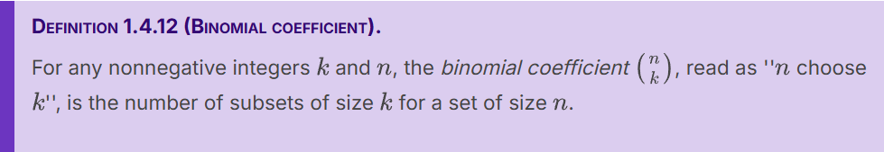
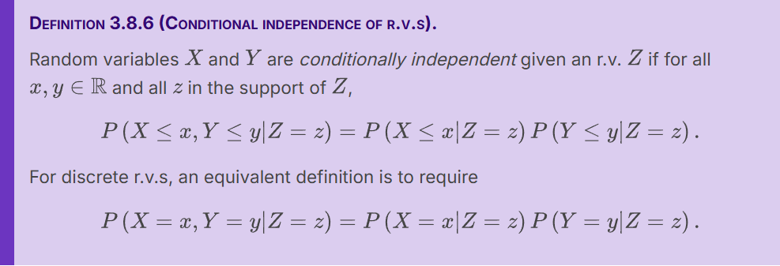
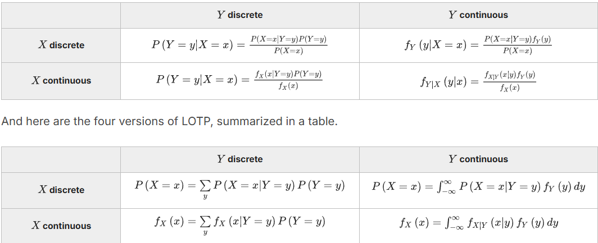
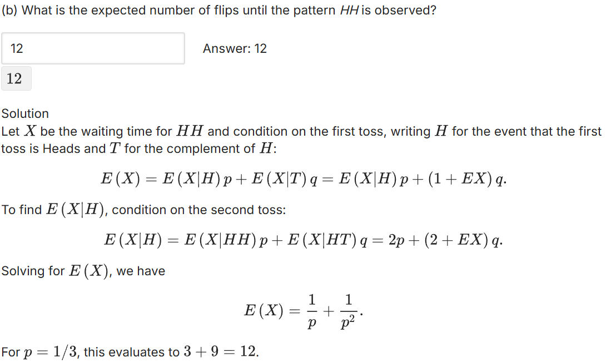
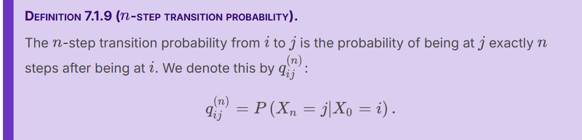

# unit1 Probability counting and story proof
## 1.2

- 样本空间可有限可无限，有限就可以变成pebble world
	- 这种情况下做实验等价于从peddles中随机采样
	- Each pebble represents an outcome, and an event is a set of pebbles
### dictionary of set theory


- 德摩根定律：交集的补集=补集的并集
## 1.3

- restrictions:等可能并且样本空间有限
## 1.4
- 乘法原则



## 1.5 story proof


## 1.6
general definition

- 关于概率函数:
	- 1.频率观点：认为概率表示一种在大量重复实验条件下的长期频率
	- 2.贝叶斯观点：对所讨论事件的信任程度


## work

## word
axiom:公理
factorial:阶乘
unions, intersections, and complements:并集、交集、补集

# unit2 conditional probability and baye's rule
## 2.1
- conditioning:the soul
	- In fact, a useful perspective is that all probabilities are conditional; whether or not it's written explicitly, there is always background knowledge (or assumptions) built into every probability.
## 2.2
- ''prior" means before updating based on the evidence, and ''posterior" means after updating based on the evidence
- 检察官谬误（prosecutor's fallacy）是一种非形式谬误，系取一不甚相关、或有关但未正确考虑条件几率的数据，认定被告“无辜的几率”很小。
## 2.3
- 贝叶斯

- 全概率

## 2.4
- 条件概率仍然是概率:即所有的概率相关性质对条件概率仍成立

## 2.5

- 独立性具有对称关系
- 独立和互斥之间的关系:互斥肯定是不独立的，两者不是一个概念
- 推广到三者以上时

- 条件独立
- 
- conditional independence doesn't imply independence
- independence doesn't imply conditional independence
## 2.6
- condition is a powerful strategy(condition on what you want to know)
- e.g:著名反直觉问题

e.g:条件策略


- 辛普森悖论（英语：Simpson's paradox），是概率和统计中的一种现象，其中趋势出现在几组数据中，但当这些组被合并后趋势消失或反转。
## work

什么是条件就对着什么拆

## word
tandem:串联
chronological:按时间顺序
exacerbate:加剧
contestant:参赛者
# unit3 discrete random variables
## 3.1

- e.g:扔两次硬币的实验，设x为头向上的数量，x(HH)=2;
## 3.2


- 注意，不同的变量也有可能probability mass function 完全相同

## 3.3


## 3.4
- 超几何分布

## 3.5
- 离散均匀分布

## 3.6


## 3.7

- 对随机变量进行(从实数到实数的)函数变换得到的还是随机变量
- We can think of the distribution of a random variable as a map or blueprint describing the r.v. Just as different houses can share the same blueprint, different r.v.s can have the same distribution, even if the experiments they summarize, and the sample spaces they map from, are not the same.
## 3.8

- 若两变量独立，任何它们的函数也是独立的
  r.v.s:random variable sequence
  



## work


- 生日问题，人一个一个的来，所以要区分，是排列

## word
isomorphic:同构的
# unit4 contineous random variables
## 4.1 Probability density function

- 对于连续型随机变量，可以任意的舍弃端点
## 4.2 Uniform


## 4.3 university of the uniform(均匀分布的普适性)
- 任何数据集的百分位分布一定是均匀的
- other name：probability integral transform, inverse transform sampling, the quantile transformation, and even the fundamental theorem of simulation.


- fact(U服从标准均匀分布)
```math
P(U\leq u)=u\  for\ u\in(0,1) 
```
## 4.4 normal


## 4.5 exponential


## 4.6 poisson processes

- 在泊松过程中，t秒内无抵达的概率和t秒时抵达数为0是同一事件，所以有
```math
P(T_1>t)=p(N_t=0)=e^{-\lambda t}
```

## work

- 对称性的理解：两者是独立同分布，
```math
P(T_a>T_b)=P(T_b>T_a)
```
而两者包含了所有的情况，和为1
### 泊松过程：(“计数-时间对偶性” (Count-Time Duality))
#### 无记忆性：
时间角度，服从指数分布，等了多久对接下来还要等多久毫无影响
#### 计数角度：
```math
P(N(t)=k)=P(k\ cars\ arrive\ in\ t\ hours)=\frac{( (λt)^k * e^{-λt} )} { k!}
```
- 小于3，求和0,1,2
## word
analogous:类似的
quantile：分位数
# unit5 averages law of large numbers,and central limit theorem
## 5.1 expectation

$E(X-3)^2=E((X-3)^2)$
## 5.2  Linearity of expectation
超几何的期望： $E(X)=\frac{nw}{w+b}$
## 5.3 Geometric and Negative Binomial

- 这个是没考虑成功的那次的，考虑的叫first success distribution(FS)

几何分布的期望计算


- e.g


- 函数的期望≠期望的函数(尤其当函数非线性时)
## 5.4  Indicator random variables and the fundamental bridge


- 强大之处：无需是各变量独立的


## 5.5 Law of the unconscious statistician (LOTUS)

## 5.6 varience


## 5.7 poisson

其均值和方差均为 
$\lambda$


## 5.8 Expectation of a continuous random variable


## 5.9 Law of Large Numbers

## 5.10 Central Limit Theorem

- CLT也表明一堆独立同分布的随机变量序列之和趋近于一个正态分布

这个分布没有有限的均值和方差，所以大数定律和中心极限定理都用不了
## work
- 算同时属于两个人的朋友，算a的：从b的朋友选一部分再从剩下的选一部分
## word
asymptotic:渐进的
skewed：歪斜的，曲解的
# unit6 Joint Distributions and Conditional Expectation
## 6.1 Joint, marginal, and conditional distributions

CDF的可视化很困难，PMF用的更多


### 鸡蛋例子
问题描述:鸡生蛋的数量(N)服从泊松分布($\lambda$)，每个蛋是否孵化服从二项分布
X为孵化成功的，Y为孵化失败的，其联合分布
```math
P(X=i,Y=j)=\frac{e^{-p\lambda}(p\lambda)^i*e^{-q\lambda}*(q\lambda)^j}{i!*j!}
```	

可以发现可视为X，Y均服从泊松分布，且相互独立
		

唯一由pdf得到非零的概率的方法就是沿着一个区域积分（沿着线积分也是0）


- 四种(连续和离散组合)



## 6.2 Covariance and correlation(协方差和相关性)

- 若x，y是独立的(independent)则是无关的(uncorrelated),即协方差为0
- 独立=>无关，但是逆命题不成立


上一个定义会受到各变量的测量用的单位的影响，所以用下面这个排除量纲影响

correlation总是位于-1到1之间

## 6.3 Multinomial(多项)


## 6.4 Multivariate Normal(MVN)

MVN可以推各部分是正态的，反过来不行


- 指定一个多项正态分布
	- 均值向量（包含每个随机变量的均值）
	- 协方差矩阵(k*k)(其实还需要每个的方差，但是对角线那里已经指明)


## 6.5 Conditional expectation


- importance of condition on every situation


e.g:骰子
- 另一种解法：用FS


intuition：看一步进步之后会不会再回去
## 6.6 Conditional expectation given a random variable

## 6.7 Adam's law and other properties of conditional expectation

proof for adam's law

对等式两边的随机变量可以同时求期望和方差(协方差)
## 6.8 Eve's law and conditional variance


- between group variation:$Var(E(Y|X))$
- 
- within-group variation:$E(Var(Y|X))$
- 


## work

- 三条腿的椅子不稳==所有腿在一个半圆以内



## word
reciprocal：互惠的
lump:块
unwieldy：笨重的
albeit:尽管
degenerate:退化
contour：轮廓
marginal:边缘

# 7. markov chain
## 7.1 Markov property and transition matrix



```math
q^{(n)}_{ij}is\ the (i,j) entry\ of\ Q^n
```

## 7.2 Classification of states

- 若i是一个马尔科夫链的transient state,设从i出发而不会再回到i的概率为p，这个链条从i开始，永远离开之前回到i的次数服从Geom(p)

  

- irreducible implies all states are recurrent(反过来不一定成立)
- 一个马尔科夫链内至少一个是recurrent的
- 周期的定义：


$d(i)=gcd\{n\ge1:p^{n}(i,i)\gt0\}$
## 7.3 Stationary distribution(also known as:steady-state distribution)


### google pagerank
视各网站的链接形成的网络为马尔科夫链，看其收敛之后，修正如下(为了给网络一定的再生长能力)	
```math
G=\alpha Q+(1-\alpha)\frac{J}{M}
```

```math
tG^n->s \ as\ n->∞
```
其中M为矩阵的size，J为全一矩阵
## 7.4 Reversibility(可逆性)

- reversible implies stationary

### three types of markov chain that's reversible
- first

- second
  	- if the Markov chain is a random walk on an undirected network, then there is a simple formula for the stationary distribution.(可以证明就是成比例缩放其各点的度数向量(就是每个点连出去多少根))
- third
	- Third and finally, if in each time period a Markov chain can only move one step to the left, one step to the right, or stay in place, then it is called a birth-death chain. All birth-death chains are reversible.
	- 
	- 然后解方程使 $S_1$ 满足和为1即可
棋盘类：注意很好的对称性，一般按可达到的状态分成几个状态向量(每种的个数与度数的乘积计算)

## word
transient:易变的，短暂的
irreducible：不可约
aperiodic:非周期性
greatest common divisor:最大公约数
diluted:经稀释的，稀的
teleport：传送