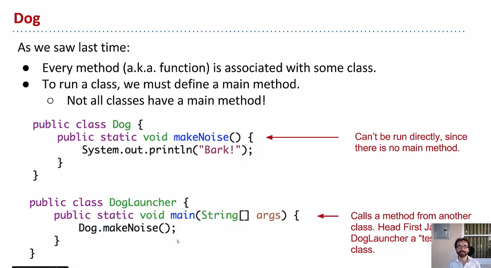
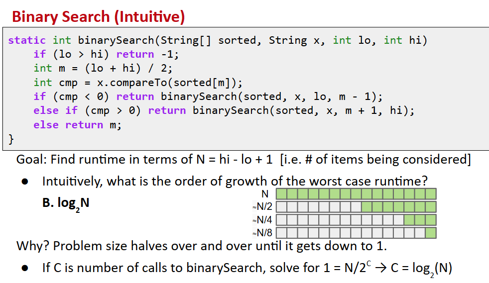
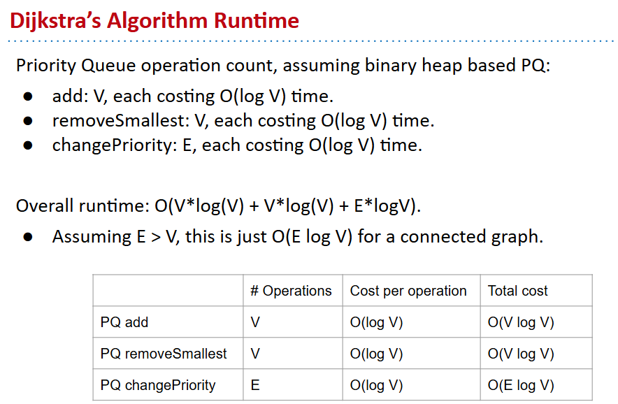
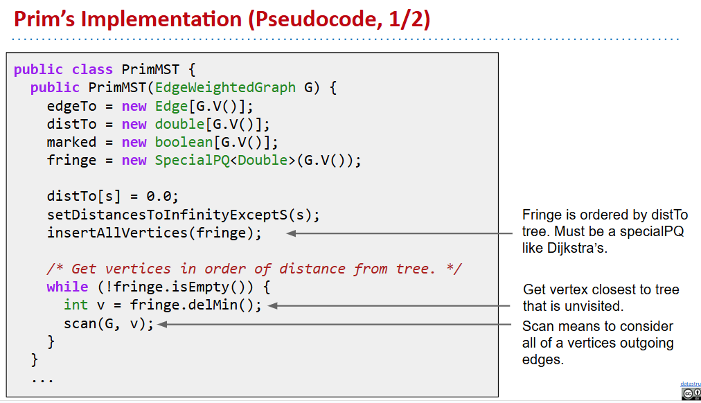
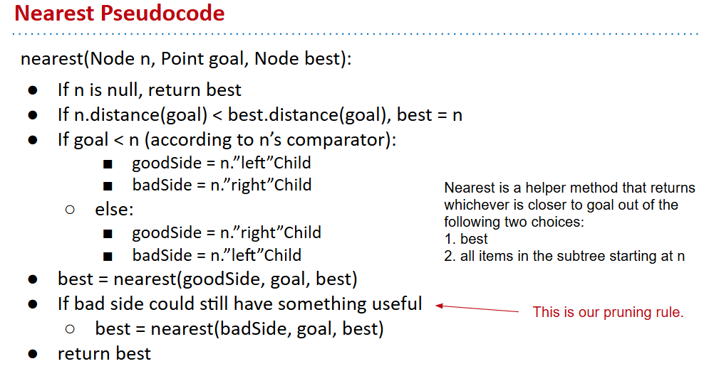
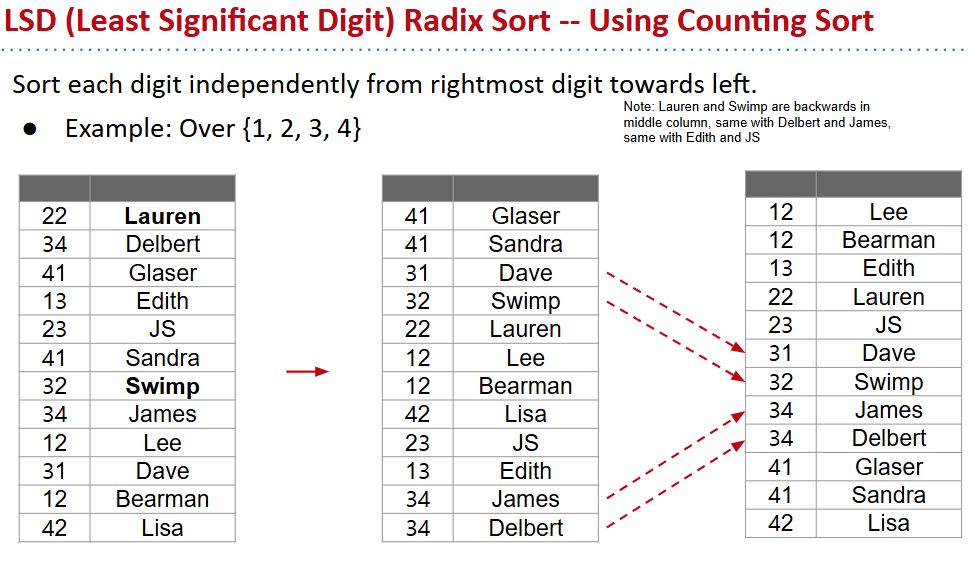

# lecture 1

## first java program

1.java程序只能以类、接口、枚举(class,interface,enum)作为程序的起始  
2.  
3.`java variables must be claimed before using and the type will not change ever since,if there exists a type error the compile can't finished`  
4function

- 所有函数以`public static`开头（其实也有别的）
- 函数必须是类的一部分，所以java中所有函数也叫方法
- 必须指明所有参数的类型和返回类型

## 交作业

```bash
git add lab1/*
git commit -m "done with Collatz"
git push origin master
#origin:远程仓库别名
#master:本地分支名称,新的可能叫main
```

# lecture 2

## 编译

编译并运行java文件  
  
小tips：可以用tab键补全文件名字  
编译生成的.class文件已经经过了类型检查，所以是类型安全的  


```java
//DogLauncher.java
public class DogLauncher{
    public static void main(String[] args){
        Dog d=new Dog(51);
        d.weightInpounds=51;
        d.makeNoise;
    }
}
//dog.java
public class Dog{		//注意此处没有static
    public int weightInpounds;
    public void makeNoise(){
        System.out.println("...");
    }
}
```


### 数组

`int[] numbers = new int[]{4, 7, 10};`  
`System.out.println(numbers[1]);`

## static and instance method


## managing the complexity

  
helper function:叙述性地拆分成多个函数来实现功能

# lecture3 Testing

## video

### ad hoc testing(临时测试)

- 就是随机生成测试用例然后调用方法后对输出结果进行比较
- 直接用不等于比较两个数组对象是有问题的(只有当两个数组的对应地址也相同的时候才会返回相等)
    - how `java.util.Array.equals`
    - 当比较两个字符串，要返回哪个字符串不对，需要遍历来做

### 库junit

- 遍历可以简化为`org.junit.Assert.assertEquals(expected,input)`
- 这个方法实际上是deprecated(已弃用)暂时还能用但是不建议
- 可以换成`assertArrayEquals`

### selection sort

  


### combine

- 开发的多个辅助函数在合并的时候接口的参数不一致，这是非常正常的
- java当中实际上没有python中的切片功能，所以sorting的设计是接收一个特殊的整数索引，告诉函数我只对数组的特定部分进行排序
- 多个testing method能让我专注于比如找到最小值的特定方法的修改
- 

### simple Junit

无需手动调用测试方法，并且格式化的输出更便于观察  
在方法前面加上`@org.junit.Test`  
  
import来使代码不那么冗长  
  
三种方法：autograder,unit test,integration  


# lecture4

## video

### reference


- 除了基础类型(int long char float double byte short boolean),别的都叫引用类型


### parameter passing

- golden rules 仍然存在

### instantiation of arrays


```java
/*递归法的size*/
public int size()
{
    if(rest==null)
    {
        return 1;
    }
    return 1+this.rest.size();
}
```

## word

novice :初学者

# lecture5

## video

### rebranding(重塑)

```java
//rename
public class IntNode {
    public int item;
    public IntNode next;

    public IntNode(int i, IntNode n) {
        item = i;
        next = n;
    }
}
```

### Bureaucracy

```java
//actually hide the details
public class SLList {
    public IntNode first;

    public SLList(int x) {
        first = new IntNode(x, null);
    }
}
```

### public vs. private

- Private variables and methods can only be accessed by code inside the same .java file, e.g. in this case SLList.java. That means that a class like SLLTroubleMaker below will fail to compile, yielding a first has private access in SLList error.
- public实际上意味着它可以一直被使用
- nested class(嵌套类):如果一个类不能独立存在，只是另一个类的附属。
    - 在SLList内嵌套IntNode的条件下:If the nested class has no need to use any of the instance methods or variables of SLList, you may declare the nested class static
- 这个size不能直接递归，需要给一个private的辅助方法(针对intNode)的

```java
/** Returns the size of the list starting at IntNode p. */
private static int size(IntNode p) {
    if (p.next == null) {
        return 1;
    }

    return 1 + size(p.next);
}

public int size() {
    return size(first);
}
```

### caching(缓存)

- seting aside something to speed up retrivial  
    在每次改变链表尺寸的同时更新size参数，在需要的时候直接返回，这加速计算

### the empty list

- 一个构造函数，创建一个null
- 但是在未检查的添加函数中会报错，一种解决方法是添加头指针检查
- another way
    - sentinel node(哨兵节点)：总是存在，不会为null，随便给一个元素，这样可以不用考虑特殊情况。  
        

### invariants(不变量)


- 哨兵节点总是不可更改的  
    `sentinal.next = new IntNode(x,sentinal.next)`

## lab2

- 以后你再创建新的 CS61B 项目时，只需在 Project Structure -> Modules -> Dependencies -> + -> Library... 中直接选择这个已经创建好的 CS61B-Libraries 即可，无需重复添加文件。（换设置后invalidate一下）
- maven可能要换一下

### debugger

- step into :一步一步的
- the “step over” button allows us to complete a function call without showing the function executing.
- step out :进入某函数时可以退出来
- 先找问题在哪个函数，再定位

### application

遍历:当list为null而不是list.next为null

- we have a nested function call, IntelliJ is asking us which function we’d like to step into. If you’d like, you can click on one or the other. If you click on max, you’ll see all the details of the call to max. If you click on firstDigitEqualsLastDigit, the call to max will get stepped-over.
- 或运算的短路效应:无论右边是什么都不执行
    - 优雅解决方法：要求一定要执行的放左边

# project 0

- 两种模式  
    

## design

- 枚举类型
    - 

## get started

* * *

**`library-sp21` 不是一个普通的文件或文件夹，而是一个 Git 子模块 (Submodule)。**

### 详细解释

#### 1\. 什么是 Git 子模块 (Submodule)？

一个子模块允许你将一个 Git 仓库作为另一个 Git 仓库的子目录。这就像一个项目（你的 `cs61b` 仓库）里面嵌套了另一个独立的项目（`library-sp21` 仓库）。

你的主仓库 (`cs61b`) 并不直接跟踪 `library-sp21` 文件夹里的每一个文件。它只跟踪一件事：**`library-sp21` 应该处于哪个特定的 commit（版本）**。

#### 2\. 解读 `git status` 的信息

```
Changes not staged for commit:
  ...
        modified:   library-sp21 (untracked content)
```

这行信息的含义是：

- `modified: library-sp21`: 主仓库 (`cs61b`) 检测到 `library-sp21` 这个子模块的状态发生了变化。
- `(untracked content)`: 这个变化的原因是，在 `library-sp21` 这个子仓库 **内部**，存在一些 **未被跟踪的文件 (untracked files)**。

#### 3\. 为什么 `git add library-sp21` 不起作用？

你在主仓库 (`cs61b`) 中运行 `git add library-sp21`，是想告诉主仓库：“请记录 `library-sp21` 的当前状态”。

然而，Git 无法记录一个“不干净”的子模块状态。子模块内部有未提交的修改或未跟踪的文件，它就处于一个不确定的、临时的状态。主仓库只能记录一个确定的 commit ID。

**所以，你必须先进入子模块，将子模块内部的改动提交，使其达到一个“干净”的状态，然后才能在主仓库中记录这个新状态。**

* * *

### 如何解决 (正确步骤)

你需要分两步走：先处理子模块内部的改动，再回到主仓库处理主仓库的改动。

#### 第 1 步：进入子模块，提交内部的更改

1.  **进入子模块目录**
    
    ```bash
    cd library-sp21
    ```
    
2.  **查看子模块内部的状态**  
    在这里运行 `git status`，你很可能会看到那些“untracked content”。
    
    ```bash
    # 你现在在 E:\learn\25-summer\cs61b\library-sp21> 目录下
    git status 
    ```
    
3.  **添加并提交子模块内部的更改**  
    将这些新文件添加到子模块的暂存区，并创建一个新的 commit。
    
    ```bash
    # 添加所有新文件
    git add .
    
    # 提交这些更改（提交信息可以自己定）
    git commit -m "Add new library content"
    ```
    
    现在，`library-sp21` 子模块本身是“干净”的了，并且它有了一个新的 commit。
    

#### 第 2 步：回到主仓库，更新子模块的引用

1.  **返回到主仓库目录**
    
    ```bash
    cd ..
    ```
    
2.  **再次查看主仓库的状态**  
    你现在应该在 `E:\learn\25-summer\cs61b>` 目录。再次运行 `git status`。
    
    ```bash
    git status
    ```
    
    输出会变得不一样，可能会像这样：
    
    ```
    On branch master
    Your branch is up to date with 'origin/master'.
    
    Changes not staged for commit:
      (use "git add <file>..." to update what will be committed)
      (use "git restore <file>..." to discard changes in working directory)
    
            modified:   library-sp21 (new commits)
    
    no changes added to commit (use "git add" and/or "git commit -a")
    ```
    
    注意，提示从 `(untracked content)` 变成了 `(new commits)`。这表示主仓库检测到子模块指向了一个新的 commit。
    
3.  **现在，添加并提交主仓库的更改**  
    这个时候 `git add` 就能正常工作了，因为它要记录的是一个确定的新 commit ID。
    
    ```bash
    git add library-sp21
    ```
    
4.  **最后，在主仓库中提交**
    
    ```bash
    git commit -m "Update library-sp21 submodule to new version"
    ```
    
    至此，整个过程就完成了。
    

* * *

### 如果你不想保留这些改动

如果你根本不想要 `library-sp21` 里的这些新文件或改动，你可以这样做：

1.  **进入子模块目录**
    
    ```bash
    cd library-sp21
    ```
    
2.  **丢弃所有改动**
    
    - **警告：`git clean` 会永久删除未跟踪的文件，请谨慎操作！**
    - `git clean -fd` 会删除所有未跟踪的文件（`-f`）和目录（`-d`）。
    - `git restore .` 会撤销对已跟踪文件的修改。
    
    ```bash
    # 检查将要被删除的文件
    git clean -nfd
    
    # 确认无误后，执行删除
    git clean -fd
    
    # 撤销对已跟踪文件的修改（如果有的话）
    git restore . 
    ```
    
3.  **返回主仓库**
    
    ```bash
    cd ..
    git status
    ```
    
    现在主仓库应该显示 `working tree clean`，一切恢复原样。
    

## assignment


```java
//core logic
 public boolean tilt(Side side) {
        /*每次移动的时候维护一个表征是否merge过的矩阵*/
        int[][] merge_matrix=new int[4][4];
        for(int i=0;i<4;i++){
            for(int j=0;j<4;j++){
                merge_matrix[i][j]=0;
            }
        }
        boolean changed=false;
        /*turn the direction*/
        if(side==Side.NORTH) {
            changed=executive(board,merge_matrix);
        }else{
            board.setViewingPerspective(side);
            changed=executive(board,merge_matrix);
            board.setViewingPerspective(Side.NORTH);
        }

        // TODO: Modify this.board (and perhaps this.score) to account
        // for the tilt to the Side SIDE. If the board changed, set the
        // changed local variable to true.

        checkGameOver();
        if (changed) {
            setChanged();
        }
        return changed;
    }
    /*another method for traverse all*/
    public boolean executive(Board board, int[][] merge_matrix){
        boolean changed = false;
        for (int col = 0; col < 4; col++) {
            for (int row = 3; row >= 0; row--) {
                Tile t = board.tile(col, row);
                if (t != null) {
                    int ju = judge_movement(col, row);
                    int m = merge(col, row, merge_matrix);
                    if (ju + m != 0) {
                        board.move(col, row + ju + m, t);
                        if (m != 0) {
                            score += t.value() * 2;
                        }
                        changed = true;
                    }
                }
            }
        }
        return changed;
    }


    /*helper method deal with the mergence,return the step it can move more*/
    public int merge(int col, int row, int[][] merge_matrix){
        for (int i = row + 1; i < 4; i++) {
            Tile t = board.tile(col, i);
            Tile cur = board.tile(col, row);
            if (t != null) {
                if (t.value() == cur.value() && merge_matrix[col][i] == 0) {
                    merge_matrix[col][i] = 1;
                    return 1;
                } else {
                    return 0;
                }
            }
        }
        return 0;
    }


    /*judge the tile can move how far from now in row*/
    public int judge_movement(int col, int row){
        int empty = 0;
        for (int i = row + 1; i < 4; i++) {
            if (board.tile(col, i) == null) {
                empty++;
            } else {
                break;
            }
        }
        return empty;
    }
```

- 理解：视角转换，这是非常有用的只用实现一个方向上的全部功能的概念  
      
    实现过程中统一使用视角下的坐标即可

#### 视角图示

| 目标方向 `Side` | 转换后的 `(col', row')`（表示“这个 tile 在新视角下的位置”） |
| --- | --- |
| `NORTH` | `(col, row)` |
| `EAST` | `(SIZE - 1 - row, col)` = `(3 - row, col)` |
| `SOUTH` | `(SIZE - 1 - col, SIZE - 1 - row)` = `(3 - col, 3 - row)` |
| `WEST` | `(row, SIZE - 1 - col)` = `(row, 3 - col)` |

- 把xx边当成上面

## word

corollary:推论、扣除

* * *

# 6 the DLList

SLList:单向链表(singly linked list)  
DLList:双向链表(doubly linked list)  
但是使用哨兵节点会有很多if来判断:很麻烦  
\- solution1：doubly sentinal:头尾各一个哨兵节点  
\- solution2：circular sentinal  
  


## project1

- 链表实现队列(先进先出的线性表，队列只允许在后端（称为rear）进行插入操作，在前端（称为front）进行删除操作)  
    

```java
//每个涉及的点两个链接都要考虑更新
public void addLast(type item){
        typenode<type> new_last=new typenode<>(item,null,null);
        sentinal.prev.next=new_last;
        new_last.next=sentinal;
        new_last.prev=sentinal.prev;
        sentinal.prev=new_last;
        size++;
    }
//recursion
//helper method for recursive call
    private type get_from_now(int index,typenode<type> node){
        if(index==0){
            return node.value;
        }else{
            index--;
            if(node.next!=null&&node.next!=sentinal){
                node=node.next;
                return get_from_now(index,node);
            }else{
                return null;
            }
        }
    }
    public type getRecursive(int index){
        return get_from_now(index,sentinal.next);
    }
```

- 数组实现双向队列
    - 1.在确定两端点指针时(边界问题，取余处理)

```java
 private void resize(double factor){
        int new_length=(int)(item.length*factor);
        T[] a=(T[])new Object[new_length];
        
        int first=(nextFirst+1)%item.length;
        for(int i=0;i<size;i++){
            a[i+1]=item[(first+i)%item.length];
        }
        item=a;
        nextFirst=0;
        nextLast=size+1;
    }

public T removeLast(){
        int last=(nextLast==0)?item.length-1:nextLast-1;
        T temp=item[last];
        item[last]=null;
        size=(size==0)?0:size-1;
        if(size<radio*item.length&&item.length>16){
            resize(0.5);
        }else{
            nextLast=last;
        }
        return temp;
    }
```

- MaxArrayDeque的测试

```java
package deque;
import org.junit.Test;
import java.util.Comparator;
import static org.junit.Assert.*;
public class MaxArrayDequeTest {
    private static class IntComp implements Comparator<Integer>{
        @Override
        public int compare(Integer o1, Integer o2) {
            return o1-o2;
        }
    }
    private static class reverseComp implements Comparator<Integer>{
        @Override
        public int compare(Integer o1, Integer o2) {
            return o2-o1;
        }
    }
    @Test
    public void EmptyTest(){
        MaxArrayDeque<Integer> stu=new MaxArrayDeque<>(new IntComp());
        assertNull(stu.max());
    }

    @Test
    public void DefaultComTest(){
        MaxArrayDeque<Integer> stu=new MaxArrayDeque<>(new IntComp());
        for(int i=0;i<10;i++){
            stu.addLast(i);
        }
        for(int i=100;i>90;i--){
            stu.addFirst(i);
        }
        assertEquals(100,(int)stu.max());
    }
    @Test
    public void AnotherComTest(){
        MaxArrayDeque<Integer> stu=new MaxArrayDeque<>(new IntComp());
        for(int i=0;i<10;i++){
            stu.addLast(i);
        }
        for(int i=100;i>90;i--){
            stu.addFirst(i);
        }
        assertEquals(0,(int)stu.max(new reverseComp()));
    }
}

```

equals

```java
public boolean equals(Object o) {
        // 检查是否是同一个对象
        if (o == this) {
            return true;
        }
        // 检查 o 是否为 null
        if (o == null) {
            return false;
        }
        // 检查 o 是否实现了 Deque 接口，这比检查具体类更通用
        if (!(o instanceof Deque)) {
            return false;
        }
        // 使用通配符 ?，因为我们只关心它是一个 Deque，不关心具体类型
        Deque<?> other = (Deque<?>) o;
        // 检查大小是否相等
        if (this.size() != other.size()) {
            return false;
        }
        // 逐个元素比较
        for (int i = 0; i < size(); i++) {
            // *** 核心修复 ***
            // 使用 Objects.equals 来安全地比较可能为 null 的元素
            if (!java.util.Objects.equals(this.get(i), other.get(i))) {
                return false;
            }
        }
        // 如果所有元素都相等，则两个 Deque 相等
        return true;
    }
```

## arrays

什么是arrays:

- array creation  
    
- 拷贝另一个(而不是相同的引用)（这样可以避免对对象的破坏性操作）  
    
- 2D array  
    实质上就是引用的引用(一个数组里面储存着对其他数组的引用)
- array和class  
    One particularly notable impact of these difference is that \[\] notation allows us to specify which index we'd like at runtime.

# 7 the ALList

- why:取特定位置的元素对于链表来说，其遍历开销很大
- removelast最简单的方法就是直接size-1即可
- 当数组已满还要添加，resize
- resize方法的性能分析：每次当数组已满的时候就要重新创建一个size+1的数组，这样执行时间很长
- SLList是线性的插入时间，而ALList是二次曲线的插入时间
- how the actual list implementation(使用几何或乘法进行缩放)

```java
public void insertBack(int x) {
    if (size == items.length) {
           resize(size * RFACTOR);
    }
    items[size] = x;
    size += 1;
}
```

但是可能会造成空间的浪费=>在空间利用率低于一定程度的时候缩小数组(这实际上就是时间空间效率的权衡)

- java不允许创建泛型数组，所以不能直接new一个类型不明确的数组  
    `Glorp[] items = (Glorp []) new Object[8];`  
    删除数组元素的时候，如果最后一个是一个对象，最好还是设置为null节省空间

## word

loiter:虚逛，徘徊

# 8 Intro and interfaces


```java
//step1:定义接口
public interface List61B<Item> {
    public void addFirst(Item x);
    public void add Last(Item y);
    public Item getFirst();
    public Item getLast();
    public Item removeLast();
    public Item get(int i);
    public void insert(Item x, int position);
    public int size();
}

//step2
public class AList<Item> implements List61B<Item>{...}

//override:就是个注释，帮助检查拼写错误
@Override
public void addFirst(Item x) {
    insert(x, 0);
}
```

- 在接口继承中：子类的指针可转换成基类的指针
- Interface Inheritance refers to a relationship in which a subclass inherits all the methods/behaviors of the superclass(只有method head)
- implementation inheritence:在接口中有对某方法的实现，可以通过子类直接调用

```java
//在接口中
//然而其get方法对于SLList 极其低效
default public void print() {
    for (int i = 0; i < size(); i += 1) {
        System.out.print(get(i) + " ");
    }
    System.out.println();
}
//解决方法：直接在SLList子类中重写该方法
```

- override:一模一样的函数签名（名，参数）
- overload:一模一样的函数名，但是签名不一样  
      
    只有通过父类调用被子类重写过的方法才会有动态方法绑定  
      
    当该变量的动态类型override 过某方法，通过该实例调用的就是override过的方法，然而该语法对overload不适用  
    对overload的方法:仅仅只是查看其静态类型  
      
    使用继承来实现is a的关系而不是has a的关系！  
    **all in all:通过静态类型来选择重载的版本，再根据运行时类型选择重写的版本**

# 9 Extends, Casting, Higher Order Functions

## extends:类之间的继承关系

`public class RotatingSLList<Item> extends SLList<Item>`  


## VengefulSLList

```java
public class VengefulSLList<Item> extends SLList<Item> {
    SLList<Item> deletedItems;

    public VengefulSLList() {
        deletedItems = new SLList<Item>();
    }

    @Override
    public Item removeLast() {
        Item x = super.removeLast();//调用父类的方法
        deletedItems.addLast(x);
        return x;
    }

    /** Prints deleted items. */
    public void printLostItems() {
        deletedItems.print();
    }
}
```

## Constructors Are Not Inherited

- 默认会调用无参数的构造函数  
    `super()`显式调用

## the object class

java的所有类其实隐式地继承了object 类(implicitly)，这使得所有类都能直接使用equals,hashcode,tostring等方法

## Encapsulation(封装)

- 若一个module的实现细节完全被封装起来了，唯一的交互方式是利用接口，这就叫被封装了
- some tool:hierarchical abstraction,design for change(organize the programs around objects、let objects to decide how things are done、hide infromation that others don't need)

## inheritence breaks encapsulation

因为我们不知道原本的具体细节，如果继承后重写的方法调用了原本的父类就会由于不同的实现产生不同的效果

## typechecking and casting

- In general, the compiler only allows method calls and assignments based on compile-time types
- Remember that the compiler determines whether or not something is valid based on the static type of the object
- casting(类型转换，指定特定的compile time type)

## Higher Order Functions(treat other function as a data)

older school java :can't directly do this

```java
//IntUnaryFunction
public interface IntUnaryFunction{
    int apply (int x);
}

//TenX
public class TenX implements IntUnary Function{
    public int apply(int x){
        return 10*x;
    }
}
//another
public static int do_twice(IntUnaryFunction f,int x){
    return f.apply(f.apply(x));
}

//call
System.out.println(do_twice(new TenX(),2));
```

# lab3 test

```java
//用时测试
package timingtest;
import org.checkerframework.checker.units.qual.A;

/**
 * Created by hug.
 */
public class test {
    private static void printTimingTable(AList<Integer> Ns, AList<Double> times, AList<Integer> opCounts) {
        System.out.printf("%12s %12s %12s %12s\n", "N", "time (s)", "# ops", "microsec/op");
        System.out.printf("------------------------------------------------------------\n");
        for (int i = 0; i < Ns.size(); i += 1) {
            int N = Ns.get(i);
            double time = times.get(i);
            int opCount = opCounts.get(i);
            double timePerOp = time / opCount * 1e6;
            System.out.printf("%12d %12.2f %12d %12.2f\n", N, time, opCount, timePerOp);
        }
    }

    public static void main(String[] args) {
        timeAListConstruction();
    }

    public static void timeAListConstruction() {
        AList<Integer> N = new AList<>();
        int base = 1000;
        for (int i = 0; i < 8; i++) {
            N.addLast((int) Math.pow(2, i) * base);
        }

        AList<Double> times = new AList<>();
        for (int i = 0; i < 8; i++) {
            AList<Integer> temp = new AList<>();
            long startTime = System.nanoTime();
            for (int j = 0; j < N.get(i); j++) {
                temp.addLast(0);
            }
            long endTime = System.nanoTime();
            // Convert nanoseconds to seconds for consistency with the original code
            double elapsedSeconds = (endTime - startTime) / 1_000_000_000.0;
            times.addLast(elapsedSeconds);
        }

        AList<Integer> ops = N;
        printTimingTable(N, times, ops);
    }
}
//随机方法调用测试
    @Test
    public void randomizedTest() {
        AListNoResizing<Integer> correct = new AListNoResizing<>();
        BuggyAList<Integer> broken = new BuggyAList<>();

        int N = 500;
        for (int i = 0; i < N; i += 1) {
            int operationNumber = StdRandom.uniform(0, 4);
            if (operationNumber == 0) {
                // addLast
                int randVal = StdRandom.uniform(0, 100);
                correct.addLast(randVal);
                broken.addLast(randVal);
                System.out.println("addLast(" + randVal + ")");
            } else if (operationNumber == 1) {
            ...
        }
    }
```

## conditioning debug

- useful button:resume可以一直运行直到打断点的地方
- right click断点，设置中断条件，下一次就可以resume直接到满足条件的地方
- execution breakpoint:run->view breakpoint 设置any exception->condition再填入你要的缺陷`this instanceof java.lang.ArrayIndexOutOfBoundsException`

## word

descendant：派生物

# 10 Subtype Polymorphism(多态) vs. HoFs

java没有像cpp一样的重载运算符的功能，只能使用接口继承来搞类似的效果

```java
 public class DMSComparator implements Comparator<Animal> {
     @Override
     public int compare(Animal o1, Animal o2) {
         int first = o1.speak(new Animal());
         int second = o2.speak(new Animal());
         int third = o1.speak(new Dog());
         int fourth = o2.speak(new Dog());
         if (first == second && third == fourth) {
         	return 0;
         } else if (first > second || third > fourth) {
         	return 1;
         } else {
         	return-1;
         }
     }
 }
```

## interface quiz

  
maxizer不会出问题:因为它只涉及ourComparable这个接口，不涉及任何的具体的实现

## Comparables

- 自己写的：已存在的类没有实现，并且这样的类用java内置库很不方便
- solution:直接用java内置的comparable接口  
    

## comparators

comparator的泛型参数必须默认是object而非基础类型:int不行Integer行

```java
import java.util.Comparator;

public class Dog implements Comparable<Dog> {
    ...
    public int compareTo(Dog uddaDog) {
        return this.size - uddaDog.size;
    }

    private static class NameComparator implements Comparator<Dog> {
        public int compare(Dog a, Dog b) {
            return a.name.compareTo(b.name);
        }
    }

    public static Comparator<Dog> getNameComparator() {
        return new NameComparator();
    }
}

Comparator<Dog> nc = Dog.getNameComparator();
```


## disc04

📌 Java 方法调用的分派规则

- 调用者（接收者对象，this）
    - 编译期：先看调用者的静态类型，决定能调用哪些方法（即方法签名是否存在）。
    - 运行期：再根据调用者的动态类型，决定最终执行哪个实现（若有 override）。  
        👉 这就是所谓的 动态绑定 (dynamic dispatch)。
- 参数（方法的形参匹配）
    - 只在编译期生效：根据实参的 静态类型 来决定调用哪个方法签名（即 重载选择）。
    - 运行期：参数的动态类型 不会影响方法签名的选择，只要能赋值给形参，就调用确定好的签名。

动态类型转换:编译时检查的是静态类型(向下转换是可以的)，运行时检查看其动态类型  
一个类调用函数:若该类的实现不满足会去父类里面找  
不允许super.super()  
  
调用者这么看，参数看其静态类型

# 11\. Exceptions, Iterators, Object Methods

## Lists, Sets, ArraySet

```java
//list
import java.util.List;
import java.util.ArrayList;

public class Example {
    public static void main(String[] args) {
        List<Integer> L = new ArrayList<>();
        L.add(5);
        L.add(10);
        System.out.println(L);
    }
}
//set
import java.util.Set;
import java.util.HashSet;
Set<String> s = new HashSet<>();
s.add("Tokyo");
s.add("Lagos");
System.out.println(S.contains("Tokyo")); // true
```

- 使用数组实现集合:ArraySet
    - 注意，在contain方法(检查是否包含某个东西)的时候需要使用x.equals()而不是直接的等号，因为=可能直接去比较两个对象的地址。
    - 然而，当用户往集合中添加null的时候可能会出现问题(null没有equals方法)
        - solution1:`throw new IllegalArgumentException("can't add null");`(不允许添加null)
        - solution2:检查，如果x和item\[i\]均为null，return true

## iteration

- enhanced for loop:`for (i:aset)`
- ugly loop:

```java
Iterator<String> seer = s.iterator();
while (seer.hasNext()) {
    String city = seer.next();
```

### implements

```java
//首先在类定义实现该接口
public interface Iterable<T> {
    Iterator<T> iterator();
}
//嵌套在Arrayset里面
private class ArraySetIterator implements Iterator<T> {
    private int wizPos;

    public ArraySetIterator() {
        wizPos = 0;
    }

    public boolean hasNext() {
        return wizPos < size;
    }

    public T next() {
        T returnItem = items[wizPos];
        wizPos += 1;
        return returnItem;
    }
}

public Iterator<T> iterator() {
    return new ArraySetIterator();
}
```

## object method

### ToString

- 默认的tostring 方法打印出类的名称+@+内存位置，
- System.out.println(class)会隐式的调用类的ToString 方法
- String 使用+与其它类型的数据链接的时候也会默认调用Tostring方法，这种直接相加的方法每一次都要重新创造一个新字符串，所以运行起来很慢
- 解决方法:使用一种StringBuilder对象

```java
public String toString() {
        StringBuilder returnSB = new StringBuilder("{");
        for (int i = 0; i < size - 1; i += 1) {
            returnSB.append(items[i].toString());
            returnSB.append(", ");
        }
        returnSB.append(items[size - 1]);
        returnSB.append("}");
        return returnSB.toString();
    }
```

### equals

- 区分：==比较的是两者的bit(即使两个完全一样的对象，地址不一样也不相等)而equals才比较的是我们所需要的
- 注意：要override这个方法的话参数必须是Object other

```java
public boolean equals(Object other) {
        if (this == other) {
            return true;
        }
        if (other == null) {
            return false;
        }
        if (other.getClass() != this.getClass()) {
            return false;
        }
        ArraySet<T> o = (ArraySet<T>) other;
        if (o.size() != this.size()) {
            return false;
        }
        for (T item : this) {
            if (!o.contains(item)) {
                return false;
            }
        }
        return true;
    }
```

# 12

## command line programming

普通java程序里面的main函数的参数实际上是命令行参数  
普通命令行方法`javac hello.java`(调用编译器)->`java hello`(调用解释器)  
而c语言编译器直接转化为二进制文件，不需要解释器

## git

- 使用哈希和引用避免富余(不同文件哈希值重复的概率极低)  
      
      
    
- 使用序列化和树来储存
    - 只需要在声明commit类的时候implement serializable就行，不需重写任何方法
    - 之后就可使用Utils.readObject

# 13\. Asymptotics(渐进) I

- API(Application Programming Interface) of an ADT is the list of constructors and methods and a short description of each.
- ADT's (Abstract Data Structures) are high-level types that are defined by their behaviors, not their implementations.
- delegation vs. extension:后者要求你知道extends的类的方法的具体实现，前者不要求，在你不想让新类变成旧类的子类的时候
- Views: Views are an alternative representation of an existed object. Views essentially limit the access that the user has to the underlying object. However, changes done through the views will affect the actual object.

## an introduction to asymptotics

### Techniques for Measuring Computational Cost

- 直接测量程序运行的时间(受机器，测试数据等的影响)
- 我们关心该算法所具体要求的操作次数(以数量级的形式)e.g: n, logn
    - 简化考量(order of growth):仅考虑算法所面对的最坏的情况、根据数量级选出最主要的操作(cost model)、去除低阶项和线性乘法的系数
    - Given some function, Q(N), we can apply our last two simplifications to get the order of growth of Q(N)
- big theta  
    
- big o  
    

## disc05

- Iterators are the actual object we can iterate over. An example of this would be an array- we can iterate through the object in the array. Iterables are object that can produce an iterator that somehow iterate over their contents. If we have a class called CS61B, it itself cannot be iterated over, but it can produce an iterator that iterates over all of the students in the class.

```java
//iterator of iterator
 public class IteratorOfIterators implements Iterator<Integer> {
 	LinkedList<Iterator<Integer>> iterators;
     //仅包含非空的迭代器，简化逻辑
 	public IteratorOfIterators(List<Iterator<Integer>> a) {
 		iterators = new LinkedList<>();
 		for (Iterator<Integer> iterator : a) {
 			if (iterator.hasNext()) {
 				iterators.add(iterator);
 			}
 		}
 	}
     @Override
     public boolean hasNext() {
         return !iterators.isEmpty();
     }
     @Override
     public Integer next() {
     	if (!hasNext()) {
     		throw new NoSuchElementException();
     	}
     	Iterator<Integer> iterator = iterators.removeFirst();
     	int ans = iterator.next();
     	if (iterator.hasNext()) {
         iterators.addLast(iterator);
     	}
     	return ans;
     }
 }
```

# lecture14 disjoint sets(Union find并查集)

- 两个操作：connect(将两个元素连接起来)、isconnected(判断是否连接)
- 比较好的方法:使用集合储存所有的(connected component)

## implements

- ListOfSets使用集合的列表，然而这样的话两个操作都是O(n)的，及其低效复杂(选用的基础block极大的影响代码的复杂度和性能)
- Quick Find使用单纯的列表，在元素对应的位置维护其属于哪个集合，isconnected变为O(1)
- Quick Union:放弃维护其属于哪个集合，维护其父节点，没有父节点的设置为-1
    - 
    - 当树很长的时候非常之慢
- weighted quick union:
    - 
    - 实现：父节点的维护值变为(-size)，维护weight而不是height因为这样的代码更简单
    - 
- weighted quick union with path compression:
    - 

# lecture 15 Asymptotics II

two ways of runtime analysis:counting the operation、geometric explaination

## loop example2

```java
public static void printParty(int N) {
   for (int i = 1; i <= N; i = i * 2) {
      for (int j = 0; j < i; j += 1) {
         System.out.println("hello");   
         int ZUG = 1 + 1;
      }
   }
}
```


- 没有捷径！！！！  
    

## recursion

```java
public static int f3(int n) {
   if (n <= 1) 
      return 1;
   return f3(n-1) + f3(n-1);
}
```

$C(1)=1$  
$C(N)=2*C(N-1)+1$

## binary search

- 就是类似二分法求方程根  
    
- 对数运行时间是非常快的,并且对于$\theta$来说可以直接忽略底数不同的差异

## merge sort(合并排序)

- arbitrary units of time:任意单位(AU)来表示物质的量、强度或其他物理量和一个预定义的参考物理量之间的关系  
      
    

## big o and big theta

- 后者需要限制最好和最坏的情况，前者不需要
- 后者实际上能给出更多的信息量
- 前者实际上并不是总是描述的最坏的情况，但是很多情况下被滥用
- big omega  
    

## Amortized Analysis(平摊分析)

  


# 16\. ADTs, Sets, Maps, BSTs

ADT:由其具有的操作而不是具体实现定义的

- java内置:list、set、maps(实际上就是python字典)

## binary search tree


- 链表实现的二叉搜索树:首先进行排序，然后哨兵节点指向中间
    - 从7次搜索下降到2次

definition of tree:  
  
  
properties:左边的元素都小于右边的元素，传递性和非对称性

### search

```java
//伪代码，别当真
//复杂度为logN
static BST find(BST T, Key sk) {
   if (T == null)
      return null;
   if (sk.equals(T.key))
      return T;
   else if (sk ≺ T.key)
      return find(T.left, sk);
   else
      return find(T.right, sk);
}
```

### insert

```java
static BST insert(BST T, Key ik) {
  if (T == null)
    return new BST(ik);
  if (ik ≺ T.key)
    T.left = insert(T.left, ik);
  else if (ik ≻ T.key)
    T.right = insert(T.right, ik);
  return T;
}
```

## deletion

- situation1:没有子节点
- situation2:有一个子节点:删了之后重新指向
- situation3:有两个子节点
    - 
    - 通俗来说就是找左边最大或者右边最小来替换

## lab6

- The only way we can maintain persistence between executions is to store data on the file system.

### make


- windows条件下使用python3命令:mklink &lt;python3&gt; &lt;python&gt;
- 使用javac编译多个文件:直接全附上就行
- 当main方法处于ca包中:先退至ca的上一级目录再运行java ca/main才能跑

### Files and Directories in Java

- 获得current work directory(CWD):`System.getProperty("user.dir")`
- Note: the root of your file system is different from your home directory. Your home directory is usually located at C:/Users/&lt;your username&gt; (Windows) or /home/&lt;your username&gt; (Mac/Linux). We use ~ as a shorthand to refer to your home directory
- files
    - 创建文件对象：`File f = new File("dummy.txt");`
    - 实际创建文件并检验是否存在:`f.createNewFile();f.exists()`
    - directory实际上也是file对象
- 序列化

```java
import java.io.Serializable;

public class Model implements Serializable {
    Model m = ....;
    File outFile = new File(saveFileName);
    try {
        ObjectOutputStream out =
            new ObjectOutputStream(new FileOutputStream(outFile));
        out.writeObject(m);
        out.close();
    } catch (IOException excp) {
        ...
    }
}
```

- 提供具体类作为参数:dogs.class
- `Integer.parseInt(args[3])`字符串转整形
- `Integer.toString()`
- 判断是否空文件:`f.length==0`
- 对象：一个文件存一个就挺好
- `f.listFiles()`文件夹中的文件对象列表
- 也可以使用JVM在IDEA中调试命令行程序

# 17\. B-Trees

- 对二叉搜索树而言：最坏情况(稀疏):O(n)，最好情况(稠密):O(logn)
- 一个worst case相对而言是比O更有信息量的说法  
    
- 事实证明:即使是完全相同的元素，只要插入顺序不同，得到的树的结构都完全不同
- 数学证明:只要我们以随机方式插入元素，就会有相当高的概率形成一个稠密的树(但是在实际过程中不太可能)

## B-Tree

- 既然添加叶节点总是增加深度，那么就规定最大深度，不提高深度而是横向上分裂  
    

## B-Tree invarient


## runtime analysis

- The worst-case runtime situation for search in a B-tree would be if each node had the maximum number of elements in it and we had to traverse all the way to the bottom. We will use L to denote the number of elements in each node. This means would would need to explore logN nodes (since the max height is logN due to the bushiness invariant) and at each node we would need to explore L elements. In total, we would need to run LlogN operations. However, we know L is a constant, so our total runtime is O(logN).

# 18 Red Black Tree

## Tree rotation

  
可以证明：虽然拥有相同元素的二叉搜索树可能具有不同的结构，但是可以通过有限次的旋转互相转换

## RedBlackTree


### properties

- 其高度小于对应2-3树的两倍  
    

### 如何构建

  
具体实现相当简单

```java
private Node put(Node h, Key key, Value val) {
    if (h == null) { return new Node(key, val, RED); }
 
    int cmp = key.compareTo(h.key);
    if (cmp < 0)      { h.left  = put(h.left,  key, val); }
    else if (cmp > 0) { h.right = put(h.right, key, val); }
    else              { h.val   = val;                    }
 
    if (isRed(h.right) && !isRed(h.left))      { h = rotateLeft(h);  }
    if (isRed(h.left)  &&  isRed(h.left.left)) { h = rotateRight(h); }
    if (isRed(h.left)  &&  isRed(h.right))     { flipColors(h);      } 
 
    return h;
}

```

# 19 hashing

- using data as an index:创建一个全为false的数组，添加就是把该数字对应的位置设置为True
- 改良：使用编码使其能够表示字符串
- 有个问题：整数的溢出(Unicode的基数太大)，我们需要进行映射
- 做法：
    - 对具有相同哈希索引的item，对应位置不再是单纯的布尔值，而是一个链表头，储存了所有的哈希索引相同的值，为了提高效率，通常通过取模得同值来确定其索引位置
    - 为了保证在相同位置(bucket)的查找是常数时间，我们需要确保总数和数组大小的比值有一个上限:超了就用resize。但是这依赖于元素的均匀分布
- hashcodefunction:使用base数作为进制，base数通常选择比较小的质数
- 对递归结构和对象集合：拿它们的哈希值来再使用进制法算一遍(对负哈希值，通常使用Math.floor映射到对应index)


## lab7

```java
//注意：局部变量的问题
    private BSTNode<K,V> put_from_now(K key,V val,BSTNode<K,V> p)  {
        if(p==null){
            p = new BSTNode<>(key,val);
        }else if(compareto(key,p.key)>0){
            p.right=put_from_now(key,val,p.right);
        }else{
            p.left=put_from_now(key,val,p.left);
        }
        return p;
    }
    public void put(K key, V value)   {
        pointer=put_from_now(key,value,pointer);
    }
```

# 20 Heaps and PQ(priority queue)s


- 引入：每天的文本找前m个最不友好的，需要一直跟踪最小值和最大值并且处理有可能的重复值，所以直接的二叉搜索树不太好用

## heap


### heap操作

add:根据原则填到最底下然后往上swim  
removesmallest:最底下的换到root然后往下掉

### tree representation

  
法三要求树是完整的:parent直接(k-1)/2向下舍入就找到了  


## search data structure summary

  
stack:只能在栈顶插入和删除  
queue:队尾入队头出

# 21\. Tree and Graph Traversals

## Trees and Traversal


- 实际上树的概念远不止一个搜索和组织数据的数据结构，它是个更抽象的概念
- 对树的所有元素进行迭代:Tree traversals

### depth first traversal(深度优先遍历)

- preorder:先visit再遍历子节点(适合目录列表)

```plaintext
preOrder(BSTNode x) {
    if (x == null) return;
    print(x.key)
    preOrder(x.left)
    preOrder(x.right)
}
```

- inorder:遍历左侧子节点，visit再遍历右侧

```plaintext
inOrder(BSTNode x) {
    if (x == null) return;
    inOrder(x.left)
    print(x.key)
    inOrder(x.right)
}
```

- postorder:先分别遍历左右节点，再visit(收集文件大小)

```plaintext
postOrder(BSTNode x) {
    if (x == null) return;
    postOrder(x.left)
    postOrder(x.right)
    print(x.key)
}
```


## graphs

- definition:一组node，以及链接两个node的edges
- simple graph:没有指向自己的边(a.k.a no loops),没有两条边链接相同的node(没平行的)
- 本课默认简单图  
    

# graph problems


- 递归法解决st连通问题  
    
    - This idea of exploring a neighbor’s entire subgraph before moving on to the next neighbor is known as Depth First Traversal.

  


# 22\. Graph Traversals and Implementations


## graph API


## Graph Representation and Graph Algorithm Runtimes

- 三种表示方法  
      
      
    

## Graph Traversal Implementations and Runtime

  
  


# Project2

调试用

```
javac ./gitlet/*.java
cp ./gitlet/*.class "E:\learn\25-summer\test\gitlet"
```

## intro video

### init


### add

java查找子字符串:indexof,没找到则返回-1  
string.contains()  


### commit

java.util.date:创建对象的时候自动捕获当前时间  
字符串对象.split():分割  


- detatched head:reset 或者checkout到某个具体的分支的时候可能会造成当前head指向的状态不属于任何分支

```bash
# 1. 从当前 HEAD 创建新分支
git switch -c temp-main

# 2. 让 main 分支指向当前内容
git branch -f main temp-main
git switch main

# 3. 强制推送 main 到远程
git push origin main --force

# 4. 可选：清理临时分支
git branch -d temp-main
```


## word

hexadecimal:十六进制  
behoove：理应、必须

# lecture 23 Shortest Paths

## Dijkstra’s Algorithm

- 解法应该是不会包含环结构的(对于有向or无向图都是一样的)
- 从一个原点到所有的节点的最短路径应该总是一颗树(并且树的最长路径应该是v-1)
- 
    - For each edge from v to w, add edge to the SPT only if that edge yields better distance.(We’ll call this process “edge relaxation”.)

## Dijkstra’s Correctness and Runtime

- 伪代码


- 证明:对已经变白的(加入进去了)进行relax一定会失败
- 所以对负权重的就不一定成立



- 然而上述对于仅仅关心两地最短路径来说计算代价太高

## A\*

  
h函数的要求:admissible、consistent

# lecture 24 Minimum Spanning Trees

  
有些时候对合适的顶点找SPT得到的也是整体的最小生成树，但是不一定

- why:其算法就是一个有顶点一个没有顶点

## cut property


### Prim

  
直接使用概念中的算法实现是低效的(会重复访问大量的紫色的边)  


- 与迪杰斯特拉的不同:记录的不是到原点的距离，应该是距离已有的生成树的最短距离  
      
      
      
    

### Kruskal’s Algorithm

  


## lab8

- When creating a new Collection&lt;Node&gt;\[\] to store in our buckets variable, be aware that in Java, you cannot create an array of parameterized type. Collection&lt;Node&gt; is a parameterized type, because we parameterize the Collection class with the Node class. Therefore, the expression new Collection&lt;Node&gt;\[size\] is illegal, for any given size. To get around this, you should instead create a new Collection\[size\]
- 声明抽象类和抽象方法(abstract关键字)
- 负载因子:load_factor=num_of_elements/num_of_buckets
- 负载因子默认0.75,意味着其只有75%的桶非空，只是时间和空间的权衡而已

# 25\. Range Searching and Multi-Dimensional Data

## Range-Finding and Nearest


## Multi-dimensional Data

- 之前的所有树的实现都要求数据可以以某种顺序进行比较，实际上数据可能是多维的
- 常见多维数据比如空间坐标
- 一种方法是仅根据某个坐标进行构建，完全可行，但在某些情况下的查找非常之慢
- 剪枝(prune):在搜索的时候仅查看部分子节点

## quadtrees

### concept

- 就是一个节点有四个子节点(对应二维空间中的四个方位)
- 实质上是一种spatial partition(分成四个象限)
- 每次查找实际上就是找当前节点的哪些象限可能存在查找空间的
- 

## higher dimetion

- 四叉树对应二维空间做的很好，但是更高维的用这种思想就会显得极其繁琐
- KD tree才是更好用的(这里的维度不一定是具体物理意义的空间维度，可以仅仅指区分各物体的特征)
- 思想:每次仅利用一个坐标把空间分成两半，然后轮换着来
- 

### nearest (最近邻函数)

  
**图**  
决定是否查看取决于剪枝策略:可以比较粗略(只算点到无限矩形的垂直距离)，也可以严格去算  


## Uniform partitioning

四叉树和kd树可以视为对空间的不均匀分割，但其实很多时候均匀分割的精度对我们来讲已经足够  


# 26\. Prefix Operations and Tries(字典树)

## Tries

- add:就是一个字母一个字母的加，单词末尾标记一下
- contain:沿着路径，如果路径末尾未被标记就不是，也有可能这条路径不存在  
    

## Trie Implementation and Performance

- basic implementation
    - 当确定是字符串的时候，可以使用ascii码进行数字索引和字符的对应映射，这样访问会变成常数时间  
        
- 就键的数目而言，我们实现了两种操作的常数时间访问，这是字符串长度的一次关系

## Alternate Child Tracking Strategies

- 实际上使用dataindexedcharmap是非常消耗内存的
- 两种方法，在映射关系上使用二叉树或者哈希表  
      
    

## Trie String Operations

- 其实实际上并没有这么方便，真正有用的是其能更好的支持一些字符串特有的操作(相比二叉树和哈希表而言)
- 
- 

## autocomplete

前缀匹配找出分最高的前几个

- 改进:压缩树or缓存当前得分  
      
    

# 27 Softengineering I

## Complexity Defined

- 其它工程都有现实规律的限制，但是软件工程仅取决于你自己的创造性和对问题的理解
- There are two approaches to managing complexity:
    - Making code simpler and more obvious.
        - Eliminating special cases, e.g. sentinel nodes.
    - Encapsulation into modules.
        - In a modular design, creators of one “module” can use other modules without knowing how they work.
- complexity:任何有关软件结构的使其难以理解和修改维护的属性
- 要避免复杂性，但是有些时候无法避免(本身要求完成的功能就极其复杂)
- 另一种定义$C=\sum_{i=0}^nc_i\times t_i$
    - 其中c是各部分的复杂度,t是花在各部分的工作时间

## Symptoms and Causes of Complexity


## Strategic vs. Tactical Programming

  


# 28 Decomposition and Reductions

## Topological Sorting

- 一个有向图，点代表任务，边代表依赖关系，要给出一条合理的路径(有点像是大学课程地图中的先修依赖图)  
    
- solution  
    
- be ware:depth first search is a not so clear concept:it includes both with restart and without.
- Another better topological sort algorithm:(only suitable for DAG)
    - Run DFS from an arbitrary vertex.
    - If not all marked, pick an unmarked vertex and do it again.
    - Repeat until done.

## Shortest Paths on DAG(directed ascylic graph)s

- 普通的迪杰斯特拉算法在面对负权重时会失效(因为其有时不会考虑到负权重边对其的影响)
- 那么就采用一种访问顺序考虑到所有影响  
      
    

## Longest Paths

- 在一般图上:目前已知的最好算法是指数级的
- 在有向无环图中:将边权取反后运行SPT算法再反转即可

## Reduction

- If any subroutine for task Q can be used to solve P, we say P reduces to Q.
- example:
    - Independent set:给定一个图，二色地涂部分点使得同色点之间无连接
    - 3SAT: Given a boolean formula, does there exist a truth value for boolean variables that obeys a set of 3-variable disjunctive constraints?
    - 

# 29\. Basic Sorts

- verbose definition of sort:
    - An ordering relation < for keys a, b, and c has the following properties:
        - Law of Trichotomy: Exactly one of a < b, a = b, b < a is true.
        - Law of Transitivity: If a < b, and b < c, then a < c.
    - another way to state:perform operations to reduce the inversion to zero

## Selection Sort and Heapsort

- selection sort:
    - Find smallest item.
    - Swap this item to the front and ‘fix’ it.
    - Repeat for unfixed items until all items are fixed.

时间复杂度:O($n^2$)

- heap sort(naive):
    - Insert all items into a max heap, and discard input array. Create output array.
    - Repeat N times:
        - Delete largest item from the max heap.
        - Put largest item at the end of the unused part of the output array.

时间复杂度降低到n(log n)  
但是需要额外一个堆数组和答案数组，空间开销大

- in place heap sort:
    - 

## Mergesort

- Split items into 2 roughly even pieces.
- Mergesort each half (steps not shown, this is a recursive algorithm!)
- Merge the two sorted halves to form the final result.

time complexity:O(n log n)  
space complexity:O(n)

## insertion sort

```plaintext
for i = 1 to A.length-1
    key = A[i]
    /* insert A[i] into the sorted sequence A[0,...,j-1] */
    j = i - 1
    while j >= 0 and A[j] > key
        A[j+1] = A[j]
        j--
    A[j+1] = key

```

- naive approch:insert one element to a proper position once a time
- efficient way:do things using swap in place(下限为线性复杂度)
    - Repeat for i = 0 to N - 1:
        - Designate item i as the traveling item.
        - Swap item backwards until traveller is in the right place among all previously examined items.
# 30 quick sort
- 在一个几乎排序好的数组中:插入排序非常之快
	- One exchange per inversion (and number of comparisons is similar). Runtime is Θ(N + K) where K is number of inversions.
	- Define an almost sorted array as one in which number of inversions ≤ cN for some c. Insertion sort is excellent on these arrays.
## Backstory, Partitioning
- 背景:使用字典的对应关系搞一个最简单的机器翻译系统
	- 然而使用磁带的年代binary search不是logn的复杂度(磁带要来回倒)
	- 一个方法是先对句子排序，然后只用扫描一次就行
	- Tony's method:使用分区进行排序(partitioning)
	 


## quick sort
quick sort a.k.a. partitioning sort
- partitioning on the leftmost item(都可以,只是hug选了这个而已)
- quick sort the left right
- quicksort the left left
## Quicksort Runtime
- best case :每次都分到最中央(但是只要能分配到某个百分位数之后，就能证明其复杂度还是可以的)

- worst case:最坏每次都分到最边上

# 31 soft engineeringII
## Modular Design
- 理想情况下，我们的设计应该完全将世界分成彼此独立的模块，但是这实际上不可能，模块之间需要通信。
- The best modules are those whose interfaces are much simpler than their implementation
- The best modules are those that provide powerful functionality yet have simple interfaces. I use the term deep to describe such modules
- 
# 32 More Quick Sort, Sorting Summary
## avoid the worst case
- 1. Randomness: Pick a random pivot or shuffle before sorting.
- 2. Smarter pivot selection: Calculate or approximate the median.
- 3. Introspection: Switch to a safer sort if recursion goes to deep.
- 4. Preprocess the array: Could analyze array to see if Quicksort will be slow. No obvious way to do this, though (can’t just check if array is sorted, almost sorted arrays are almost slow).

- partitioning

- 还有一种加速的方法时选取准确的中位数，但是开销极大
## quick selection

基于分区的快速选择，已知最快
## summary
- Selection sort: Find the smallest item and put it at the front.
- Insertion sort: Figure out where to insert the current item.
- Merge sort: Merge two sorted halves into one sorted whole.
- Partition (quick) sort: Partition items around a pivot.

stability:值相等的元素保持原有顺序不变(heap和quick不稳定，其实quick 要看分区策略，三次扫描法就稳定)
# 33 soft engineering III
## word
dopamine:多巴胺
revenue:收入
skew:倾斜
conspiracy:阴谋
plastic:整形的
consor:审查
# 34. Sorting and Algorithmic Bounds
- 正规的sort 实现:当数组元素为对象的时候，使用归并排序(要稳定性)，就是纯数字，就用快排
## Math Problems out of Nowhere

## theoritical boundary

- 该游戏可以归约到一个排序问题，类比物理过程，完成该过程的做功至少要大于等于最小值
# 35. Radix sort
## counting sort
- 一个例子:sleep sort，休眠整数秒之后打印出来，这样实际上并没有比较
- 另一个:空间换时间，创造一个数组，把键为i的复制到第i个位置上
- 
- run time analysis:

## LSD Radix sort
- 前述的排序仅适用于其键来自有限的字母表
- 核心想法就是将可能无限的键拆分成字母表中键的组合，然后一个一个来排(对不一样长的键采取补位,相当于进行了宽度次counting sort)

## MSD Radix sort
- 就是从左往右的LSD,但是每次仅排序上一个以比较的键是相同的

# 36. Sorting and Data Structures Conclusion
- 对排序耗时的理论分析(注意仅仅是理论)

- 实际上:有just in time copiler对代码进行优化(这使得对代码的实际运行时间分析变得相当困难)
  
## LSD Radix Sort on Integers
- 法一：将数字视为等效的字符串
- 法二：直接修改
- 


# 38 compression
## Prefix Free Codes
- 一种编码方式是莫斯密码，但是它可能有歧义(某个符号的前缀是另一个符号)
- 解决的一种方式就是采用无前缀编码(编码树上所有的字符都在子节点上)
- 采用不同的无前缀编码的压缩效果是不同的


## Shannon Fano Codes 
- not optimal but very intuitive


## Huffman Coding

- encoding and decoding 


## conpressing thory

- 一个普适的压缩算法是不存在的(你的原序列和目标序列的集合大小差距非常大)
- 并且我们不仅需要考虑压缩后的大小，还得考虑解压本身的成本有可能很大

# 39 Compression, Complexity
- one better way to compression:create a readable java(whatever else) code that could produce the output
## Kolmogorov Complexity 

 - 证明


## Space/Time Bounded 
- 即使是理论上，生成一个最优压缩的算法也是不存在的
- 生成一个空间占用小于给定值的算法也是不存在的(如果存在就可以使用类似二分查找的方法锁定最小值)
- 但是我们可以给出一个时间空间上界的算法
- 
## P=NP?


# 40 conclusion


