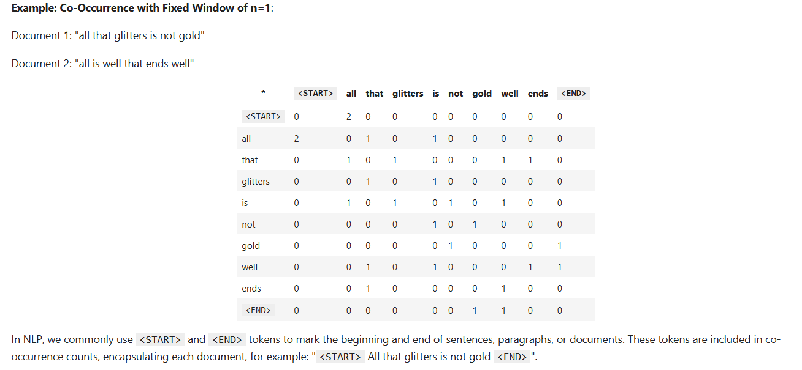
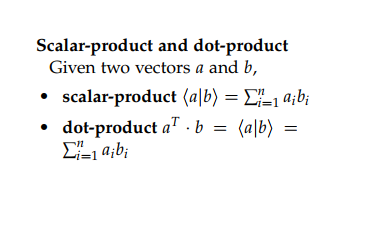
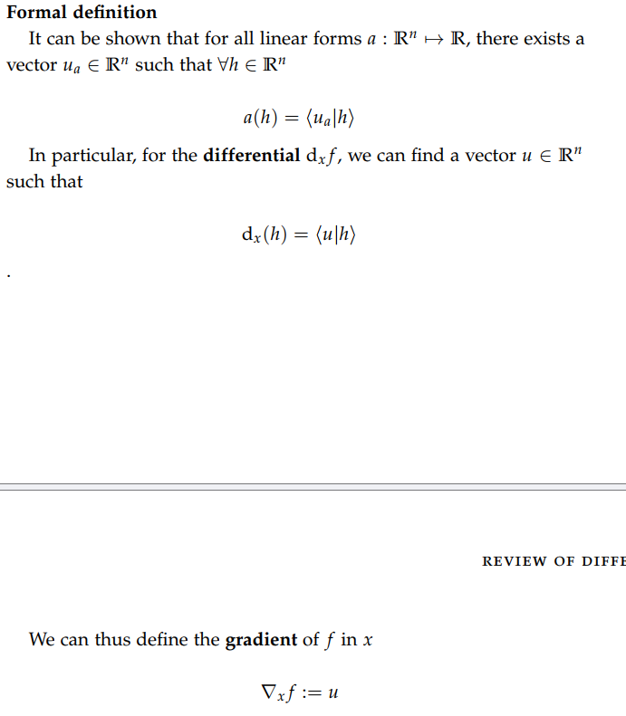
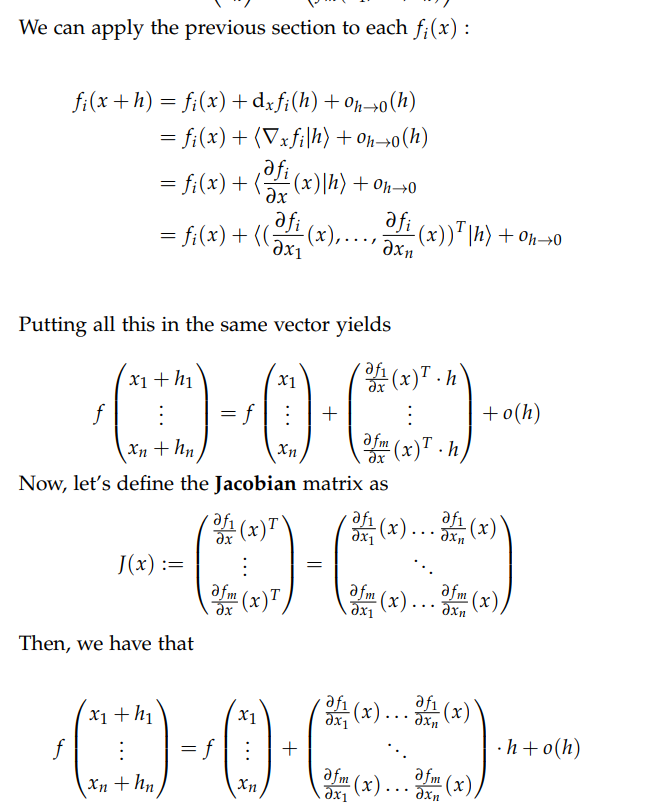
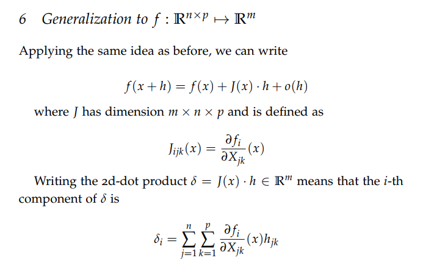
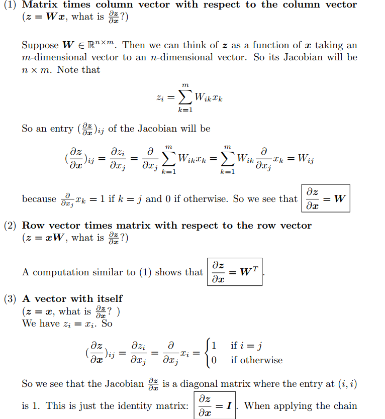
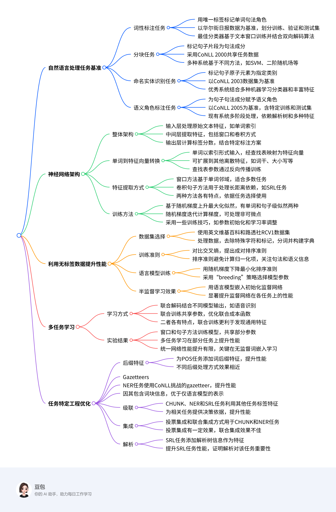
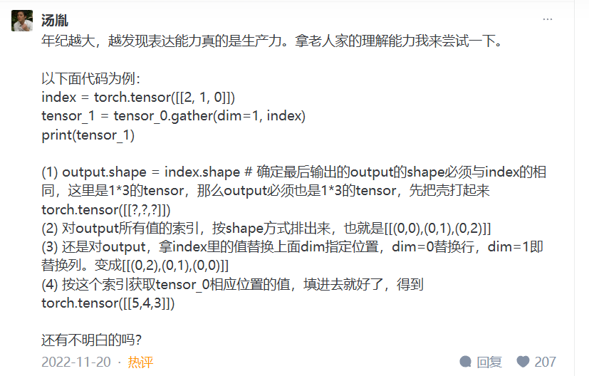

# work1:

单词:  
cooccurrence matrices（共现矩阵）  
symmetric（对称）  
semantic(语义学的)  
synonyms（同义词）  
antonyms(反义词)  
analogy (类比)

cooccurrence matrices:  


func1:去除重复单词并计数（利用set的特性）

```python
#复习内容：集合
def distinct_words(corpus):
    """ Determine a list of distinct words for the corpus.
        Params:
            corpus (list of list of strings): corpus of documents
        Return:
            corpus_words (list of strings): sorted list of distinct words across the corpus
            n_corpus_words (integer): number of distinct words across the corpus
    """
    corpus_words = []
    n_corpus_words = -1
    
    # ------------------
    # Write your implementation here.
    stored=set()
    for sentence in corpus:
        for words in sentence:
            stored.add(words)
    for words in stored:
        corpus_words.append(words)
        n_corpus_words+=1
    n_corpus_words+=1
    corpus_words=sorted(corpus_words)
    # ------------------

    return corpus_words, n_corpus_words
```

func2:计算共现矩阵

```python
#字典，api使用规范
def compute_co_occurrence_matrix(corpus, window_size=4):
    """ Compute co-occurrence matrix for the given corpus and window_size (default of 4).
    
        Note: Each word in a document should be at the center of a window. Words near edges will have a smaller
              number of co-occurring words.
              
              For example, if we take the document "<START> All that glitters is not gold <END>" with window size of 4,
              "All" will co-occur with "<START>", "that", "glitters", "is", and "not".
    
        Params:
            corpus (list of list of strings): corpus of documents
            window_size (int): size of context window
        Return:
            M (a symmetric numpy matrix of shape (number of unique words in the corpus , number of unique words in the corpus)): 
                Co-occurence matrix of word counts. 
                The ordering of the words in the rows/columns should be the same as the ordering of the words given by the distinct_words function.
            word2ind (dict): dictionary that maps word to index (i.e. row/column number) for matrix M.
    """
    words, n_words = distinct_words(corpus)
    M = None
    word2ind = {}
    
    # ------------------
    # Write your implementation here.
    i=0
    for w in words:
        word2ind[w]=i
        i+=1
        
    M=np.zeros((n_words,n_words))#numpy创建的形状用元组
    for sentence in corpus:
        w_index=0
        for word in sentence:
            mi=(w_index-window_size) if (w_index-window_size)>=0 else 0
            ma=(w_index+window_size) if (w_index+window_size)<=(len(sentence)-1) else len(sentence)-1
            #命名别重，也可以采用内置的min,max函数
            for ind in range(mi,ma+1):
                if(ind!=w_index):
                    M[word2ind[word],word2ind[sentence[ind]]]+=1
            w_index+=1
    
    
    # ------------------

    return M, word2ind
```

func3:进行嵌入操作

```python
def reduce_to_k_dim(M, k=2):
    """ Reduce a co-occurence count matrix of dimensionality (num_corpus_words, num_corpus_words)
        to a matrix of dimensionality (num_corpus_words, k) using the following SVD function from Scikit-Learn:
            - http://scikit-learn.org/stable/modules/generated/sklearn.decomposition.TruncatedSVD.html
    
        Params:
            M (numpy matrix of shape (number of unique words in the corpus , number of unique words in the corpus)): co-occurence matrix of word counts
            k (int): embedding size of each word after dimension reduction
        Return:
            M_reduced (numpy matrix of shape (number of corpus words, k)): matrix of k-dimensioal word embeddings.
                    In terms of the SVD from math class, this actually returns U * S
    """    
    n_iters = 10    # Use this parameter in your call to `TruncatedSVD`
    M_reduced = None
    print("Running Truncated SVD over %i words..." % (M.shape[0]))
    
    # ------------------
    # Write your implementation here.
    svd=TruncatedSVD(n_components=k,n_iter=n_iters)
    M_reduced=svd.fit_transform(M)
    #svd.fit返回的是一个transformer对象
    # ------------------

    print("Done.")
    return M_reduced
```

func4:画图  
list is unhashable:  
在 Python 中，字典和集合中的元素必须是可哈希的（hashable），即能够通过哈希函数转换为一个唯一的哈希值。可哈希的数据类型包括整型（int）、浮点型（float）、字符串（str）等，而不可哈希的数据类型包括列表（list）、集合（set）和字典（dict）等，因为它们是可变的。

```python
#别想太多
def plot_embeddings(M_reduced, word2ind, words):
    """ Plot in a scatterplot the embeddings of the words specified in the list "words".
        NOTE: do not plot all the words listed in M_reduced / word2ind.
        Include a label next to each point.
        
        Params:
            M_reduced (numpy matrix of shape (number of unique words in the corpus , 2)): matrix of 2-dimensioal word embeddings
            word2ind (dict): dictionary that maps word to indices for matrix M
            words (list of strings): words whose embeddings we want to visualize
    """

    # ------------------
    # Write your implementation here.
    num=len(words)
    
    for i in range(num):
        point=M_reduced[word2ind[words[i]]]
        plt.scatter(point[0],point[1])
        plt.text(point[0]+0.003,point[1]+0.003,words[i],fontsize=9)
        
    plt.show()
    # ------------------
```

You should use the wv_from_bin.most_similar(word) function to get the top 10 most similar words. This function ranks all other words in the vocabulary with respect to their cosine similarity to the given word

When considering Cosine Similarity, it's often more convenient to think of Cosine Distance, which is simply 1 - Cosine Similarity.

Find three words $(w_1,w_2,w_3)$ where $w_1$ and $w_2$ are synonyms and $w_1$ and $w_3$ are antonyms, but Cosine Distance $(w_1,w_3) <$ Cosine Distance $(w_1,w_2)$.

As an example, $w_1$\="happy" is closer to $w_3$\="sad" than to $w_2$\="cheerful". Please find a different example that satisfies the above. Once you have found your example, please give a possible explanation for why this counter-intuitive result may have happened.

You should use the the `wv_from_bin.distance(w1, w2)` function here in order to compute the cosine distance between two words.

# work and lesson2

- intrisinc:1.通过类比进行评分：  
    man:woman->king:queen.  
    2.通过相似性评分判断：人类对一些单词组的比较进行评估(连续分数)
- 词义向量：一个单词可以分到不同的单词簇里面，每个簇里面都可以学习到一个vector

# lesson3 reading

## review-differential-calculus

  


### 雅可比行列式：



### 当f是从$R^{m*n}$映射到$R$时

可以将输入变形为$R^{mn}$形状的向量，其中A\[i,j\]=a\[i+nj\]

### 继续推广



## gradient-notes

  


# work 2

torch.gather高效取  
e.g

```python
import torch

tensor_0 = torch.arange(3, 12).view(3, 3)
print(tensor_0)

index = torch.tensor([[2, 1, 0]])
tensor_1 = tensor_0.gather(1, index)
print(tensor_1)
```

  
func1

```python
#理解题意！只是要建立映射
    def embedding_lookup(self, w):
        """ Utilize `w` to select embeddings from embedding matrix `self.embeddings`
            @param w (Tensor): input tensor of word indices (batch_size, n_features)

            @return x (Tensor): tensor of embeddings for words represented in w
                                (batch_size, n_features * embed_size)
        """

        ### YOUR CODE HERE (~1-4 Lines)
        ### TODO:
        ###     1) For each index `i` in `w`, select `i`th vector from self.embeddings
        ###     2) Reshape the tensor using `view` function if necessary
        ###
        ### Note: All embedding vectors are stacked and stored as a matrix. The model receives
        ###       a list of indices representing a sequence of words, then it calls this lookup
        ###       function to map indices to sequence of embeddings.
        ###
        ###       This problem aims to test your understanding of embedding lookup,
        ###       so DO NOT use any high level API like nn.Embedding
        ###       (we are asking you to implement that!). Pay attention to tensor shapes
        ###       and reshape if necessary. Make sure you know each tensor's shape before you run the code!
        ###
        ### Pytorch has some useful APIs for you, and you can use either one
        ### in this problem (except nn.Embedding)
        x= None
        x=self.embeddings.gather(0,w.view(-1).unsqueeze(1).expand(-1,self.embed_size))
        '''
        使用gather：避免循环
        expand:在指定维度上重复次数（-1表示不改变该维度数）
        '''
        x=x.view(-1,self.n_features*self.embed_size)
        ### END YOUR CODE
        return x
```

func2:

```python
    def forward(self, w):
        """ Run the model forward.

            Note that we will not apply the softmax function here because it is included in the loss function nn.CrossEntropyLoss

            PyTorch Notes:
                - Every nn.Module object (PyTorch model) has a `forward` function.
                - When you apply your nn.Module to an input tensor `w` this function is applied to the tensor.
                    For example, if you created an instance of your ParserModel and applied it to some `w` as follows,
                    the `forward` function would called on `w` and the result would be stored in the `output` variable:
                        model = ParserModel()
                        output = model(w) # this calls the forward function
                - For more details checkout: https://pytorch.org/docs/stable/nn.html#torch.nn.Module.forward

        @param w (Tensor): input tensor of tokens (batch_size, n_features)

        @return logits (Tensor): tensor of predictions (output after applying the layers of the network)
                                 without applying softmax (batch_size, n_classes)
        """
        ### YOUR CODE HERE (~3-5 lines)
        ### TODO:
        ###     Complete the forward computation as described in write-up. In addition, include a dropout layer
        ###     as decleared in `__init__` after ReLU function.
        ###
        ### Note: We do not apply the softmax to the logits here, because
        ### the loss function (torch.nn.CrossEntropyLoss) applies it more efficiently.

        logits = None
        w_embedding=self.embedding_lookup(w)
        m=nn.ReLU()
        w_hidden=self.dropout(m((torch.matmul(w_embedding,self.embed_to_hidden_weight)+self.embed_to_hidden_bias)))
        logits=torch.matmul(w_hidden,self.hidden_to_logits_weight)+self.hidden_to_logits_bias
        ### END YOUR CODE
        return logits
```

ps

```python
if __name__ == "__main__":

    parser = argparse.ArgumentParser(description='Simple sanity check for parser_model.py')
    parser.add_argument('-e', '--embedding', action='store_true', help='sanity check for embeding_lookup function')
    parser.add_argument('-f', '--forward', action='store_true', help='sanity check for forward function')
    args = parser.parse_args()
#形如上面这种，在命令行运行的时候加参数 -e/-f才会运行对应的程序
```

func3

```python
def minibatch_parse(sentences, model, batch_size):
    """Parses a list of sentences in minibatches using a model.

    @param sentences (list of list of str): A list of sentences to be parsed
                                            (each sentence is a list of words and each word is of type string)
    @param model (ParserModel): The model that makes parsing decisions. It is assumed to have a function
                                model.predict(partial_parses) that takes in a list of PartialParses as input and
                                returns a list of transitions predicted for each parse. That is, after calling
                                    transitions = model.predict(partial_parses)
                                transitions[i] will be the next transition to apply to partial_parses[i].
    @param batch_size (int): The number of PartialParses to include in each minibatch


    @return dependencies (list of dependency lists): A list where each element is the dependencies
                                                    list for a parsed sentence. Ordering should be the
                                                    same as in sentences (i.e., dependencies[i] should
                                                    contain the parse for sentences[i]).
    """
    dependencies = []

    ### YOUR CODE HERE (~8-10 Lines)
    ### TODO:
    ###     Implement the minibatch parse algorithm.  Note that the pseudocode for this algorithm is given in the pdf handout.
    ###
    ###     Note: A shallow copy (as denoted in the PDF) can be made with the "=" sign in python, e.g.
    ###                 unfinished_parses = partial_parses[:].
    ###             Here `unfinished_parses` is a shallow copy of `partial_parses`.
    ###             In Python, a shallow copied list like `unfinished_parses` does not contain new instances
    ###             of the object stored in `partial_parses`. Rather both lists refer to the same objects.
    ###             In our case, `partial_parses` contains a list of partial parses. `unfinished_parses`
    ###             contains references to the same objects. Thus, you should NOT use the `del` operator
    ###             to remove objects from the `unfinished_parses` list. This will free the underlying memory that
    ###             is being accessed by `partial_parses` and may cause your code to crash.
    partial_parses = [PartialParse(sentence) for sentence in sentences]
    unfinished_parses = partial_parses[:]
    while len(unfinished_parses) > 0:
        batch = unfinished_parses[:batch_size]
        transitions = model.predict(batch)#跳转定义去看：是批量预测的
        #print(batch_size,transitions)
        for partial_parse, transition in zip(batch, transitions):
            #the transition is one step for the partial_parse
            trans = partial_parse.parse_step(transition)
            if not partial_parse.buffer and len(partial_parse.stack) == 1:
                unfinished_parses.remove(partial_parse)
                 #删去的逻辑:缓冲区为空并且栈内只剩一个，符合终止条件
            	#remove:仅删去对对象的引用，不影响原对象
    dependencies = [parse.dependencies for parse in partial_parses]
    ### END YOUR CODE

    return dependencies
```

func4

```python
    def parse_step(self, transition):
        """Performs a single parse step by applying the given transition to this partial parse

        @param transition (str): A string that equals "S", "LA", or "RA" representing the shift,
                                left-arc, and right-arc transitions. You can assume the provided
                                transition is a legal transition.
        """
        ### YOUR CODE HERE (~7-12 Lines)
        ### TODO:
        ###     Implement a single parsing step, i.e. the logic for the following as
        ###     described in the pdf handout:
        ###         1. Shift
        ###         2. Left Arc
        ###         3. Right Arc
        if transition == 'S':
            self.stack.append(self.buffer[0])
            del(self.buffer[0])
        elif transition == 'LA':
            self.dependencies.append((self.stack[-1],self.stack[-2]))#注意添加的是末尾的，不一定只有几个
            del(self.stack[-2])
        elif transition == 'RA':
            self.dependencies.append((self.stack[-2],self.stack[-1]))#元组添加方式
            del(self.stack[-1])
```

func5 and 6

```python
def train(parser, train_data, dev_data, output_path, batch_size=1024, n_epochs=10, lr=0.0005):
    """ Train the neural dependency parser.

    @param parser (Parser): Neural Dependency Parser
    @param train_data ():
    @param dev_data ():
    @param output_path (str): Path to which model weights and results are written.
    @param batch_size (int): Number of examples in a single batch
    @param n_epochs (int): Number of training epochs
    @param lr (float): Learning rate
    """
    best_dev_UAS = 0
    optimizer=torch.optim.Adam(params=parser.model.parameters(),lr=lr)
    loss_func=nn.CrossEntropyLoss()
    #reduction默认为mean
    ### YOUR CODE HERE (~2-7 lines)
    ### TODO:
    ###      1) Construct Adam Optimizer in variable `optimizer`
    ###      2) Construct the Cross Entropy Loss Function in variable `loss_func` with `mean`
    ###         reduction (default)
    ###
    ### Hint: Use `parser.model.parameters()` to pass optimizer
    ###       necessary parameters to tune.
    ### Please see the following docs for support:
    ###     Adam Optimizer: https://pytorch.org/docs/stable/optim.html
    ###     Cross Entropy Loss: https://pytorch.org/docs/stable/nn.html#crossentropyloss


    ### END YOUR CODE

    for epoch in range(n_epochs):
        print("Epoch {:} out of {:}".format(epoch + 1, n_epochs))
        dev_UAS = train_for_epoch(parser, train_data, dev_data, optimizer, loss_func, batch_size)
        if dev_UAS > best_dev_UAS:
            best_dev_UAS = dev_UAS
            print("New best dev UAS! Saving model.")
            torch.save(parser.model.state_dict(), output_path)
        print("")


def train_for_epoch(parser, train_data, dev_data, optimizer, loss_func, batch_size):
    """ Train the neural dependency parser for single epoch.

    Note: In PyTorch we can signify train versus test and automatically have
    the Dropout Layer applied and removed, accordingly, by specifying
    whether we are training, `model.train()`, or evaluating, `model.eval()`

    @param parser (Parser): Neural Dependency Parser
    @param train_data ():
    @param dev_data ():
    @param optimizer (nn.Optimizer): Adam Optimizer
    @param loss_func (nn.CrossEntropyLoss): Cross Entropy Loss Function
    @param batch_size (int): batch size

    @return dev_UAS (float): Unlabeled Attachment Score (UAS) for dev data
    """
    parser.model.train() # Places model in "train" mode, i.e. apply dropout layer
    n_minibatches = math.ceil(len(train_data) / batch_size)
    loss_meter = AverageMeter()

    with tqdm(total=(n_minibatches)) as prog:
        for i, (train_x, train_y) in enumerate(minibatches(train_data, batch_size)):
            optimizer.zero_grad()   # remove any baggage in the optimizer
            loss = 0. # store loss for this batch here
            train_x = torch.from_numpy(train_x).long()
            train_y = torch.from_numpy(train_y.nonzero()[1]).long()

            ### YOUR CODE HERE (~4-10 lines)
            logits=parser.model.forward(train_x)
            loss=loss_func(logits,train_y)
            loss.backward()
            optimizer.step()
            ### TODO:
            ###      1) Run train_x forward through model to produce `logits`
            ###      2) Use the `loss_func` parameter to apply the PyTorch CrossEntropyLoss function.
            ###         This will take `logits` and `train_y` as inputs. It will output the CrossEntropyLoss
            ###         between softmax(`logits`) and `train_y`. Remember that softmax(`logits`)
            ###         are the predictions (y^ from the PDF).
            ###      3) Backprop losses
            ###      4) Take step with the optimizer
            ### Please see the following docs for support:
            ###     Optimizer Step: https://pytorch.org/docs/stable/optim.html#optimizer-step


            ### END YOUR CODE
            prog.update(1)
            loss_meter.update(loss.item())

    print ("Average Train Loss: {}".format(loss_meter.avg))

    print("Evaluating on dev set",)
    parser.model.eval() # Places model in "eval" mode, i.e. don't apply dropout layer
    dev_UAS, _ = parser.parse(dev_data)
    print("- dev UAS: {:.2f}".format(dev_UAS * 100.0))
    return dev_UAS
```