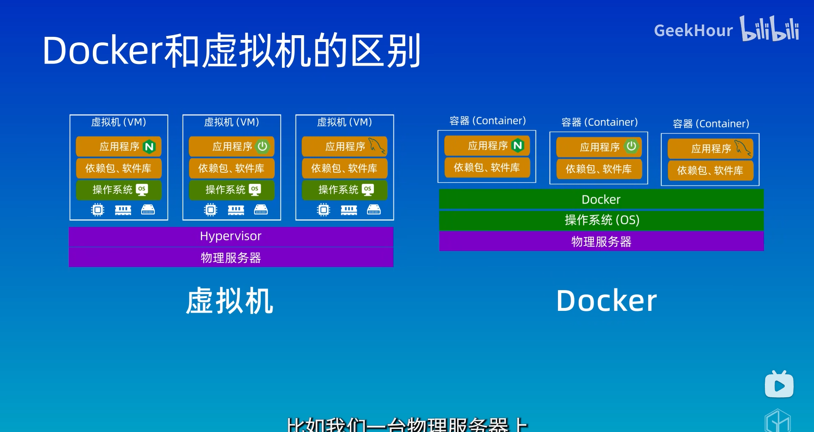
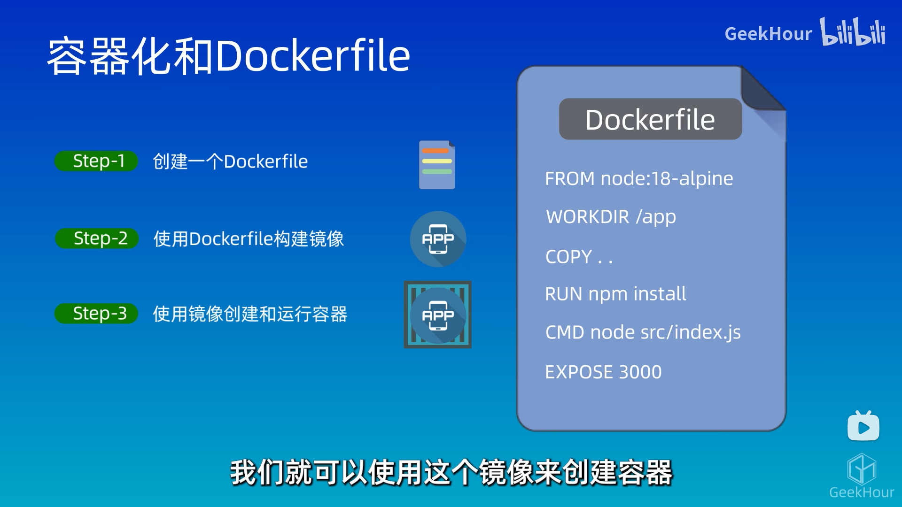
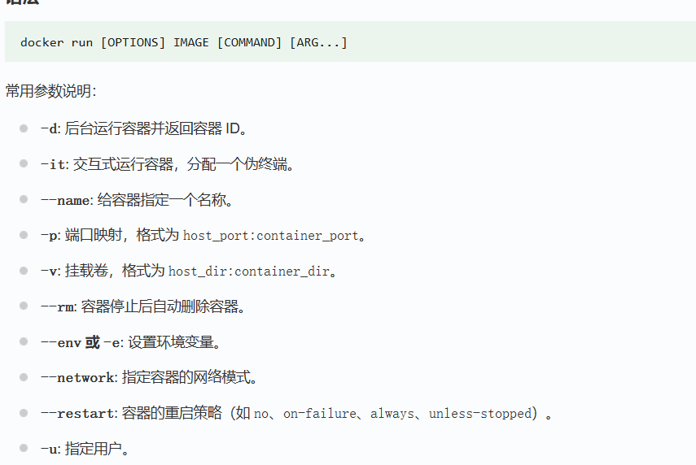
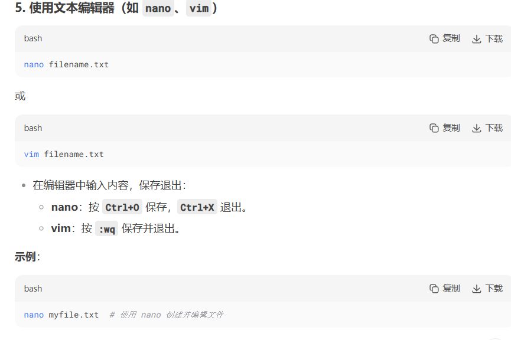
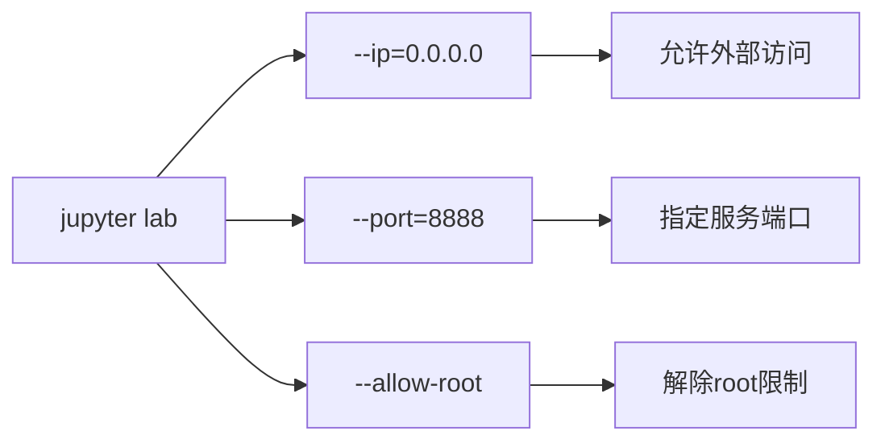

  
基本原理和概念：  
镜像：只读的模板  
容器：运行实例  
仓库：存储镜像（dockerhub）

windows在使用docker之前要先开启hyper-v功能  
wsl默认的网络在用不了windows的代理  
解决：  
看clash代理的端口地址：如果有mixed直接用，没有再用http/https等  
windows获取真实地址：`ipconfig | findstr "IPv4"`  
clash配置：

```bash
mixed-port: 5165       # 混合代理端口
allow-lan: true        # 必须为 true
bind-address: '*'      # 监听所有接口
```

windows端验证监听  
`netstat -ano | findstr "5165"`  
修正端口：

```bash
export http_proxy="http://192.168.1.100:5165"
export https_proxy="http://192.168.1.100:5165"
curl -v http://www.google.com
```

设置每次打开自动设置：(windows主机ip改变的时候需重新设置)  
1.编辑shell文件

```
nano ~/.bashrc  # 如果用 Bash
ctrl+o保存
enter
ctrl+x退出
# 或
nano ~/.zshrc   # 如果用 Zsh
```

```
#不知道为什么获取到的是linux自带的ip
# 自动获取 Windows 主机 IP 并设置代理
export WIN_IP=$(cat /etc/resolv.conf | grep nameserver | awk '{print $2}')
export http_proxy="http://$WIN_IP:5165"  # 替换为你的代理端口
export https_proxy="http://$WIN_IP:5165"
export socks_proxy="socks5://$WIN_IP:5165"  # 如果支持 SOCKS5

source ~/.bashrc  # 立即生效
```

（自动获取更改）

```
# 添加到 ~/.bashrc 或 ~/.zshrc
export WIN_IP=$(grep -oP 'nameserver \K[\d.]+' /etc/resolv.conf)
export http_proxy="http://$WIN_IP:5165"
export https_proxy="http://$WIN_IP:5165"
export PATH=$PATH:/mnt/c/Windows/System32/WindowsPowerShell/v1.0
# 获取所有 IPv4 地址，排除虚拟网卡和本地回环
Get-NetIPAddress -AddressFamily IPv4 | 
    Where-Object { $_.InterfaceAlias -notmatch "Virtual|Loopback" } | 
    Select-Object InterfaceAlias, IPAddress
```

有些时候找不到path但是能正常用

```shell
# 清除哈希缓存
hash -r

# 重新加载PATH
exec $SHELL

# 验证调用
powershell.exe -Command "Get-Date"
```

windows设置脚本

```shell
#get_ip.ps1
(Get-NetIPAddress -AddressFamily IPv4 | Where-Object { $_.InterfaceAlias -notmatch "Virtual|Loopback" } | Select-Object -First 1).IPAddress
```

在bash中

```
export WIN_IP=$(powershell.exe -ExecutionPolicy Bypass -File "C:\\get_ip.ps1" | tr -d '\r')
```

3.29.11

```
#使用ip route，此方法可行
export WIN_IP=$(ip route | awk '/default/ {print $3}' | head -1)
```

# 容器化



# 示例

vscode有专门扩展  
文件名就叫Dockerfile  
网站：play with docker  
docker images:镜像列表  
`ls -ld .`查看权限:`sudo`管理员权限  
切换到用户目录`cd ~/`  
Dockerfile

```
#基础镜像：
FROM node:14-alpine
#node本身基于linux构建，14表示版本，alpine是轻量级linux发行版
#程序复制到镜像中
COPY:源路径(相对本路径) 镜像路径
COPY index.js /index.js
#运行
CMD node /index.js
```

`docker build -t <name> .(点表示目录)`  
`docker run <name>`  
volumes:逻辑卷：映射到宿主机（防止数据丢失）

# cs224n

- windows下，先打开desktop才能用  
    运行：

```shell
docker run --gpus all -it ufoym/deepo bash
```

  
exit:退出  
`touch`创建文件  


## 传入数据:

在 Docker 中，将外部文件导入容器有以下几种常用方法：

* * *

### **方法 1：使用 `docker cp` 命令（适合单次文件传输）**

```bash
# 从宿主机复制文件到正在运行的容器
docker cp /宿主机/文件路径 容器ID或名称:/容器内/目标路径

# 示例：将本地的 data.txt 复制到容器的 /app 目录
docker cp ~/data.txt my_container:/app/data.txt
```

- **适用场景**：临时传输文件到已运行的容器。
- **注意**：容器必须正在运行（可用 `docker ps` 查看容器ID）。

* * *

### **方法 2：挂载宿主机目录（推荐，实时同步）**

```bash
docker run -it -v /宿主机/目录:/容器内/目录 镜像名称
```

- **示例**：
    
    ```bash
    # 将宿主机的 ~/project 挂载到容器的 /workspace
    docker run -it -v ~/project:/workspace ufoym/deepo bash
    #e.g
    docker run -it -v "E:\learn\cs224n_stanford\a1\student":/workspace ufoym/deepo bash
    ```
    
- **特点**：
    - 文件在宿主机和容器内实时同步。
    - 适合开发调试（修改代码无需重新复制）。

* * *

### **方法 3：构建镜像时复制文件（Dockerfile）**

在 Dockerfile 中使用 `COPY` 或 `ADD` 指令：

```dockerfile
FROM ufoym/deepo
COPY ./宿主机文件 /容器内路径
```

然后构建镜像：

```bash
docker build -t my_image .
```

- **适用场景**：需要将文件永久嵌入镜像时使用。

* * *

### **方法 4：通过共享卷（Volume）**

```bash
# 1. 创建 Docker 卷
docker volume create my_volume

# 2. 启动容器并挂载卷
docker run -it -v my_volume:/容器内路径 镜像名称

# 3. 将文件复制到卷中（需通过临时容器）
docker run --rm -v my_volume:/target -v /宿主机路径:/source alpine \
  cp /source/文件 /target/
```

- **特点**：适合需要持久化数据的生产环境。

* * *

### **方法 5：通过 `docker exec` 和管道传输**

```bash
# 将宿主机文件内容直接传递给容器内的命令
cat 宿主机文件 | docker exec -i 容器名称 容器内命令 > 容器内文件

# 示例：将本地 script.py 导入容器的 /app 目录
cat ~/script.py | docker exec -i my_container bash -c "cat > /app/script.py"
```

- **适用场景**：简单文本文件的快速传输。

* * *

### **注意事项**

1.  **权限问题**：
    
    - 挂载目录时，容器内进程可能需要与宿主机相同的用户权限。
    - 可通过 `-u` 指定用户：
        
        ```bash
        docker run -it -v ~/data:/data -u $(id -u):$(id -g) 镜像名称
        ```
        
2.  **路径格式**：
    
    - Windows 路径需转换（如 `C:\data` → `/c/data`）。
3.  **安全风险**：
    
    - 避免挂载敏感目录（如 `/`、`/etc`）。

* * *

### **验证文件是否导入成功**

进入容器检查：

```bash
docker exec -it 容器名称 ls /容器内路径
# 或直接查看内容
docker exec -it 容器名称 cat /容器内路径/文件名
```

根据需求选择最适合的方法即可！

### 使用jupyter

`jupyter lab --ip=0.0.0.0 --port=8888 --allow-root`  
输出url在浏览器中打开  
启动容器的时候需要添加端口映射

```
docker run -it -p 8888:8888 ufoym/deepo jupyter lab --ip=0.0.0.0 --port=8888 --allow-root
```

以下是 `jupyter lab --ip=0.0.0.0 --port=8888 --allow-root` 命令中各参数的详细解释：

* * *

### **1\. `jupyter lab`**

- **作用**：启动 JupyterLab 交互式开发环境（比传统 Jupyter Notebook 更强大的界面）。
- **对比**：
    - `jupyter notebook`：启动经典 Notebook 界面。
    - `jupyter lab`：支持 Notebook、终端、文本编辑器、文件浏览等多面板操作。

* * *

### **2\. `--ip=0.0.0.0`**

- **作用**：指定 Jupyter 服务监听的 IP 地址。
- **详细说明**：
    - `0.0.0.0` 表示监听所有可用的网络接口（包括本地和外部网络）。
    - 如果设置为 `127.0.0.1`（默认值），则只能通过本地主机访问，**无法从外部（如宿主机或其他设备）访问**。
- **典型场景**：
    - 在 Docker 容器内运行时必须设为 `0.0.0.0`，否则宿主机无法访问。

* * *

### **3\. `--port=8888`**

- **作用**：指定 Jupyter 服务运行的端口号。
- **详细说明**：
    - 默认端口是 `8888`，如果被占用可改为其他端口（如 `--port=9999`）。
    - 需与 Docker 的端口映射配合使用（如 `-p 8888:8888`）。
- **端口冲突处理**：
    
    ```bash
    # 检查端口占用
    netstat -tulnp | grep 8888
    # 或改用其他端口
    jupyter lab --port=9999
    ```
    

* * *

### **4\. `--allow-root`**

- **作用**：允许以 root 用户身份运行 Jupyter（默认禁止，因安全风险）。
- **详细说明**：
    - 在 Docker 容器中，默认用户常为 `root`，若不添加此参数会报错：  
        `Running as root is not recommended. Use --allow-root to bypass.`
    - **安全建议**：
        - 生产环境中应创建非 root 用户运行 Jupyter。
        - 临时测试可用此参数绕过限制。

* * *

### **5\. 其他常用参数（补充）**

| 参数  | 作用  | 示例  |
| --- | --- | --- |
| `--no-browser` | 不自动打开浏览器 | 适合在远程服务器运行 |
| `--NotebookApp.token=''` | 禁用 token 验证 | 方便本地测试（不安全） |
| `--notebook-dir=/workspace` | 指定默认工作目录 | 避免启动时手动切换路径 |

* * *

### **完整命令示例（Docker 环境）**

```bash
docker run -it \
  -p 8888:8888 \                          # 端口映射
  -v /宿主机路径:/workspace \              # 挂载目录
  ufoym/deepo \                           # 镜像名
  jupyter lab \                           # 启动 JupyterLab
  --ip=0.0.0.0 \                          # 允许外部访问
  --port=8888 \                           # 指定端口
  --allow-root \                          # 允许 root 运行
  --notebook-dir=/workspace               # 设置默认目录
```

* * *

### **访问 JupyterLab**

1.  命令运行后会输出类似以下 URL：
    
    ```
    http://127.0.0.1:8888/lab?token=xxxx
    ```
    
2.  在宿主机浏览器中访问：
    - 如果使用本地 Docker，直接打开 `http://localhost:8888`。
    - 如果使用远程服务器，将 `127.0.0.1` 替换为服务器 IP。

* * *

### **参数关系图**



根据需求灵活组合参数即可！

## 最终成功的

```
docker run -it -p 8888:8888 -v "E:/learn/cs224n_stanford/a1/student":/workspace ufoym/deepo jupyter lab --ip=0.0.0.0 --port=8888 --allow-root
#期望unix风格
```

## final

当你使用 `docker run` 命令挂载本地目录到 Docker 容器中，并且在 Jupyter 终端里对挂载的文件进行了修改，这些修改会自动同步到本地目录，因为挂载的本质就是让容器内的目录和本地目录共享同一套文件系统。以下是详细说明和验证步骤：

### 自动同步原理

使用 `-v` 选项进行挂载时，Docker 会在容器和本地主机之间建立一个绑定挂载。这意味着容器内 `/workspace` 目录中的任何更改都会立即反映在本地的 `E:/learn/cs224n_stanford/a1/student` 目录中，反之亦然。

### 验证修改是否同步到本地

1.  **在 Jupyter 终端修改文件**：在 Jupyter 终端里对挂载目录（`/workspace`）中的文件进行修改，例如创建一个新文件或者编辑已有文件。
2.  **检查本地目录**：在本地的文件资源管理器中打开 `E:/learn/cs224n_stanford/a1/student` 目录，查看是否已经同步了在容器内所做的修改。

### 保存 Python 包安装状态

虽然文件修改会自动同步，但 Python 包的安装是在容器的环境中进行的，并不会同步到本地。如果你希望下次启动容器时无需再次安装这些包，可以采用以下方法：

#### 方法一：提交容器为新镜像

1.  **查看正在运行的容器 ID**：在终端中执行以下命令：

```bash
docker ps
```

这会列出所有正在运行的容器，找到你运行 Jupyter Lab 的容器 ID。

2.  **提交容器为新镜像**：使用以下命令将当前容器的状态保存为一个新的 Docker 镜像：

```bash
docker commit <容器 ID> <新镜像名称>
```

例如：

```bash
docker commit 59195df59408 my_jupyter_image
```

3.  **下次启动新容器**：使用新镜像启动一个新的容器：

```bash
docker run -it -p 8888:8888 -v "E:/learn/cs224n_stanford/a1/student":/workspace my_jupyter_image jupyter lab --ip=0.0.0.0 --port=8888 --allow-root
```

#### 方法二：使用 Dockerfile

1.  **创建 Dockerfile**：在本地创建一个 `Dockerfile`，内容如下：

```Dockerfile
FROM ufoym/deepo

# 安装所需的 Python 包
RUN pip install <包名称>

# 设置工作目录
WORKDIR /workspace

# 启动 Jupyter Lab
CMD ["jupyter", "lab", "--ip=0.0.0.0", "--port=8888", "--allow-root"]
```

将 `<包名称>` 替换为你在容器中安装的 Python 包名称。

2.  **构建新镜像**：在包含 `Dockerfile` 的目录下执行以下命令：

```bash
docker build -t my_jupyter_image .
```

3.  **启动新容器**：使用新镜像启动一个新的容器：

```bash
docker run -it -p 8888:8888 -v "E:/learn/cs224n_stanford/a1/student":/workspace my_jupyter_image
```

通过以上方法，你可以确保对挂载文件的修改同步到本地，并且下次启动容器时无需再次安装 Python 包。

docker镜像之间可能有依赖关系：如果直接删除会报错  
要删父镜像就全得删：  
保留的方法：建立独立子镜像  
创建独立子镜像意味着要让子镜像不再依赖特定的父镜像，下面为你介绍两种常见的方法：基于 Dockerfile 重新构建和使用 `docker commit` 命令。

### 方法一：基于 Dockerfile 重新构建

#### 步骤

1.  **分析父镜像和子镜像的差异**  
    要先明确子镜像相对父镜像做了哪些修改，例如安装了哪些软件包、添加或修改了哪些文件等。
2.  **创建新的 Dockerfile**  
    在本地创建一个新的 `Dockerfile`，从基础镜像开始构建，逐步添加子镜像所需要的配置和文件。

以下是一个简单示例，假设原父镜像是 `ubuntu:20.04`，子镜像在其基础上安装了 `python3` 和 `pip`：

```Dockerfile
# 使用基础镜像
FROM ubuntu:20.04

# 更新包列表并安装 Python3 和 pip
RUN apt-get update && apt-get install -y python3 python3-pip

# 设置工作目录
WORKDIR /app

# 复制项目文件到工作目录
COPY . /app

# 其他配置和命令...

# 启动命令
CMD ["python3", "app.py"]
```

3.  **构建新的独立子镜像**  
    在包含 `Dockerfile` 的目录下执行以下命令：

```bash
docker build -t <新镜像名称> .
#最后的.指定目录
```

例如：

```bash
docker build -t my_independent_image .
```

### 方法二：使用 `docker commit` 命令

#### 步骤

1.  **启动子镜像对应的容器**  
    使用子镜像启动一个容器：

```bash
docker run -it <子镜像ID或名称> bash
```

例如：

```bash
docker run -it my_child_image bash
```

2.  **在容器内进行必要的修改**  
    在容器内部，移除对父镜像特定依赖的配置或文件，确保容器可以独立运行。
    
3.  **提交容器为新的独立镜像**  
    打开一个新的终端窗口，使用 `docker commit` 命令将修改后的容器保存为一个新的镜像：
    

```bash
docker commit <容器ID> <新镜像名称>
```

例如：

```bash
docker commit 123456789abc my_independent_image
```

### 验证独立镜像

构建完成后，使用以下命令查看新镜像的依赖关系：

```bash
docker image ls --tree
```

确保新镜像不再依赖原来的父镜像。

通过以上方法，你可以创建出独立的子镜像，使其不再依赖特定的父镜像。  
docker ps -a所有容器  
不要每次都用镜像创建一个新容器：  
`docker run [选项] 镜像名称 [命令] [参数]`

`docker start -i 启动容器`


another 
```docker
# 使用官方 Python 轻量级镜像
FROM python:3.9-slim

# 设置工作目录
WORKDIR /app

# 先复制依赖文件（利用 Docker 缓存层优化构建速度）
COPY requirements.txt .

# 安装依赖（可根据需要替换为清华镜像源加速）
RUN pip install --no-cache-dir -r requirements.txt -i https://pypi.tuna.tsinghua.edu.cn/simple

# 复制所有文件（排除 .git 和 .gitignore）
COPY . .

# 清理构建缓存（可选）
RUN rm -rf /tmp/* /var/tmp/*

# 设置默认运行的主脚本（可按需修改为你的入口脚本）
CMD ["python", "bilibili_video_download_v3.py"]
```