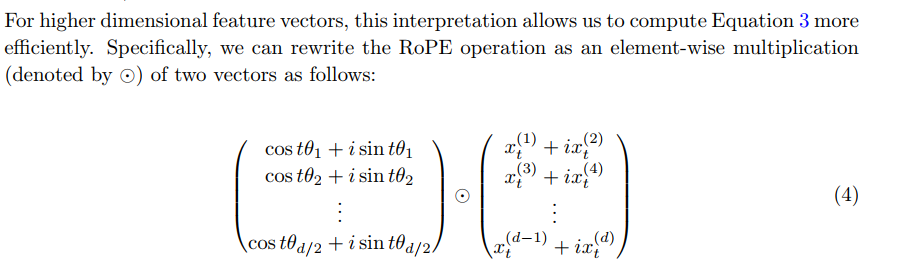
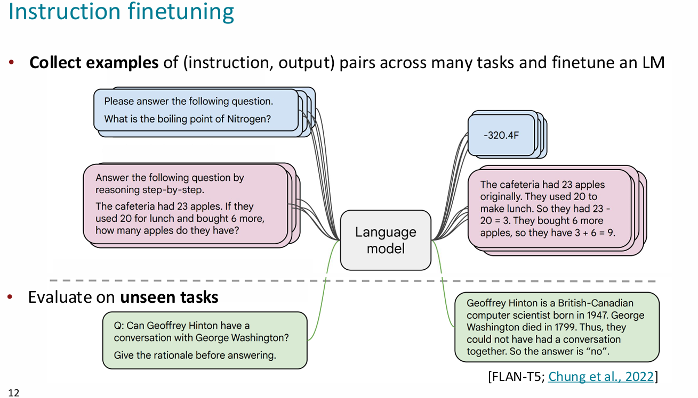

# lecture 9 Pretraining


## subword modeling

- 许多语言的单词是在不断变化的，对于某些语言的某些单词，其变体及其繁多。  
    solution：  
    
- 组合时倾向于选择最小数量的子词
- 预训练：一开始对所有参数进行训练而不仅仅是embedding层  
    
- 更强的表达：与word2vec相比，知道其在序列中的什么位置
- what can we learn from reconstructing the input
    - 情感、实际知识、文本的情景、数学背景 .etc  
        step:  
        
- 对预训练：经常需要搞一大堆标准进行评价是否整的很好
- 很多时候无标签的数据相对而言更容易获得，使得这么搞很有性价比
- 必须保证预训练数据的多样化，防止对下游任务产生影响  
    

## Model pretraining three ways


### encoder

  
选择的单词大部分时候是随机的

#### BERT

  
  
ps:"+"代表元素级别的加法，理论上也可以进行向量拼接，但是惯例是网络的中间层的size一样大小，这样更简单(segment embedding是区分两句话用的,前一句全0，后一句全1)

- 缺点：在生成文本的任务方面表现不佳
- 两种变体  
    

#### fine tune

1.  对所有参数进行微调
2.  训练部分参数或者就是新的参数(light weight fine tuning)
3.    
    ps:prefix-tuning在模型输入前添加一个连续的且任务特定的向量序列称之为prefix，固定PLM的所有参数，只更新优化特定任务的prefix。
4.  也可以多加几个层在之后并且就训练这些(tuition:模型总是过参数化的)
5.  

### encoder-decoder

  


- t5:可以从预训练好的参数中检索见过的知识

### decoder
这个才是正儿八经的语言模型

 $y$ ~ $Ah_T+b$ :
微调时的分类器用的
  


# assignment 4
点积:`\cdot`
约等于`\approx`
`\gg`远大于
`\ll`远小于
`\forall`任意
`\exists`存在	`in`属于 	`\notin`不属于
## not code
- **结论：** 单头注意力对于键向量范数的不稳定（即使方向保持）很敏感。如果一个关键的键向量（如 $k_a$）的范数随机变化很大，那么即使查询向量 $q$ 设计得很好，注意力权重也会变得不稳定，导致输出 $c$ 在不同值向量之间摇摆，而不是稳定地关注预期的组合。这使得单头注意力难以在存在此类扰动时可靠地执行需要精确权重分配的任务（比如平均多个向量）。这就是单头注意力的一个重要缺陷。
- 多头注意力如何解决：其不同头可以使用不同的注意力机制，关注不同的特征，同时无需极端大的范数对噪声进行缩放，使数值更稳定
- 位置变换：若无位置嵌入则输出token只是变换了顺序，使得模型无法学习不同的顺序的不同的语义
```python
if args.reading_params_path is not None:
        model.load_state_dict(torch.load(args.reading_params.path))
    text=open(args.finetune_corpus_path,"r").read()
    train_dataset=dataset.NameDataset(pretrain_dataset,text)
    fconfig=trainer.TrainerConfig(max_epochs=75,
             batch_size=256,
             learning_rate=args.finetune_lr,
             lr_decay=True,
             warmup_tokens=512*20,
             final_tokens=200*len(pretrain_dataset)*block_size,
             num_workers=4,
             writer=writer)
    Trainer=trainer.Trainer(model,train_dataset,None,fconfig)
    Trainer.train()
#即使不进行预训练也需要pre_train_dataset:为了获取相同的vocab
```
### 
这个错误是由于在Windows系统上使用Python的`multiprocessing`模块时，没有正确保护主模块的执行导致的。Windows系统与Unix系统不同，它使用`spawn`而不是`fork`来创建子进程，因此需要特别注意模块的导入方式。

**错误原因**：
1. 在Windows上，当使用多进程时，子进程会重新导入主模块
2. 如果没有使用`if __name__ == '__main__':`保护主代码，会导致递归创建新进程
3. 错误信息明确指出子进程在引导阶段就尝试创建新进程

**解决方案**：

1. 确保你的主程序代码（通常是包含`Trainer.train()`调用的部分）被包含在：
```python
if __name__ == '__main__':
    # 如果是Windows平台，可以加上这行
    # multiprocessing.freeze_support()  
    Trainer.train()
```

2. 具体到你的代码，需要修改`run.py`文件（第158行），将`Trainer.train()`调用放在`if __name__ == '__main__':`块中

3. 如果程序会被打包成exe，还需要添加`freeze_support()`调用

**为什么需要这样做**：
- Windows没有Unix的fork机制，所以每个子进程都需要重新导入主模块
- 不加保护会导致子进程再次执行主模块代码，形成无限递归
- `if __name__ == '__main__':`确保代码只在主进程中执行

这是Windows上使用Python多进程时的常见问题，按照上述方法修改后应该就能解决问题。

```python
class CharCorruptionDataset(Dataset):
    def __init__(self, data, block_size):
        self.MASK_CHAR = "\u2047" # the doublequestionmark character, for mask
        self.PAD_CHAR = "\u25A1" # the empty square character, for pad

        chars = list(sorted(list(set(data))))
        assert self.MASK_CHAR not in chars
        assert self.PAD_CHAR not in chars
        chars.insert(0, self.MASK_CHAR)
        chars.insert(0, self.PAD_CHAR)

        self.stoi = {ch:i for i,ch in enumerate(chars)}
        self.itos = {i:ch for i,ch in enumerate(chars)}

        data_size, vocab_size = len(data), len(chars)
        print(f'data has {data_size} characters, {vocab_size} unique.')

        self.block_size = block_size
        self.vocab_size = vocab_size
        self.data = data.split('\n')

    def __len__(self):
        return len(self.data)

   def __getitem__(self, idx):
        # TODO [part e]: see spec above
        ### YOUR CODE HERE ###
        x_raw=self.data[idx]
        length=random.randint(4,int(self.block_size*7/8))
        #begin_idx=random.randint(int(self.block_size*1/8)-1,self.block_size-5)
        x_p=x_raw[:length]
        length_second=int(random.uniform(length/6,length/3))
        begin_second=random.randint(1,length-length_second-1)#大小问题！！！
        prefix=x_p[:begin_second]
        musked_content=x_p[begin_second+1:begin_second+length_second]
        suffix=x_p[begin_second+length_second+1:]
        musked_string_q=prefix+self.MASK_CHAR+suffix+self.MASK_CHAR+musked_content
        musked_string=musked_string_q+self.PAD_CHAR*(self.block_size+1-len(musked_string_q))
        x_string=musked_string[:-1]
        y_string=musked_string[1:]
        x=torch.tensor([self.stoi[c] for c in x_string],dtype=torch.long)
        y=torch.tensor([self.stoi[c] for c in y_string],dtype=torch.long)
        return (x,y)
        pass
        ### END YOUR CODE ##
```
对于错误：
Traceback (most recent call last):
  File "E:\learn\cs224n_stanford\week_five\a4\student\src\run.py", line 106, in <module>
    text=open(args.pretrain_corpus_path,"r").read()
         ^^^^^^^^^^^^^^^^^^^^^^^^^^^^^^^^^^^^^^^^^^
UnicodeDecodeError: 'gbk' codec can't decode byte 0xa0 in position 30499: illegal multibyte sequence
windows默认某些地方用gbk，
```python
raw_text=open(args.pretrain_corpus_path,encoding="utf-8").read().strip()
char_corruption_data=dataset.CharCorruptionDataset(raw_text,block_size)
#预训练时的strip：去除换行符等，使其更纯净
```
这个错误 `RuntimeError: Trying to resize storage that is not resizable` 指出PyTorch在尝试调整一个不可调整大小的存储（storage）时失败了。这通常发生在 `DataLoader` 的数据整理（collation）阶段。

让我们来分解一下这个错误和调用栈：

1.  **错误核心**: `RuntimeError: Trying to resize storage that is not resizable`
    *   PyTorch中的张量（Tensor）背后是存储（Storage），它是一块连续的内存。
    *   `resize_` 操作试图改变这个存储的大小。
    *   如果这个存储由于某种原因（例如，它是一个视图 view，或者它是内存映射的，或者它来自一个不允许调整大小的源）被标记为不可调整大小，那么这个操作就会失败。

2.  **错误发生地点**: `torch\utils\data\_utils\collate.py` 中的 `collate_tensor_fn` 函数。
    *   `collate_fn` 是 `DataLoader` 的一个重要组成部分。当你从 `Dataset` 中取出多个样本（一个批次 batch）后，`collate_fn` 负责将这些独立的样本组织成一个或多个批处理张量（batched tensors）。
    *   `default_collate` 是PyTorch提供的默认整理函数。当它处理一批张量时，它会尝试将它们堆叠（stack）起来。为了做到这一点，它可能需要创建一个新的张量，并调整其底层存储的大小以容纳批次中的所有数据。

3.  **调用流程**:
    *   你的训练脚本 `run.py` 调用 `trainer.py` 中的 `train` 方法。
    *   `train` 方法中的 `run_epoch` 遍历 `DataLoader` (`for it, (x, y) in pbar:`).
    *   `DataLoader` 在内部使用工作进程（worker process）从你的 `Dataset` 中获取数据 (`fetcher.fetch(index)`).
    *   获取到一批数据后，调用 `collate_fn` (这里是 `default_collate`) 来将这些数据样本组合成一个批次。
    *   在 `default_collate` 内部，对于张量类型的元素，会调用 `collate_tensor_fn`。正是在这里，`elem.new(storage).resize_(len(batch), *list(elem.size()))` 这行代码尝试调整存储大小并失败了。

**可能的原因和解决方案：**

1.  **数据集中返回的张量形状不一致**：
    *   **最常见的原因**：`default_collate_fn` 期望一个批次中的所有张量（如果要堆叠它们）具有相同的形状（除了即将创建的批次维度）。例如，如果你正在处理序列数据（如文本句子），每个句子的长度可能不同。如果你直接返回这些不同长度的张量，`default_collate_fn` 无法将它们堆叠成一个规则的矩形张量。
    *   **解决方案**：
        *   **自定义 `collate_fn`**：这是处理可变长度序列的标准方法。你需要编写一个自定义的 `collate_fn`，它接收一批样本，找到这个批次中最长的序列长度，然后将所有序列填充（pad）到这个最大长度，最后再将它们堆叠起来。
        *   **在 `Dataset.__getitem__` 中填充**：虽然不太常见，但你也可以在 `Dataset` 的 `__getitem__` 方法中就将每个样本填充到某个固定的最大长度。但这通常不如在 `collate_fn` 中按批次动态填充高效。

2.  **返回的是张量的视图（View）且该视图不可调整大小**：
    *   如果你的 `Dataset.__getitem__` 返回的是一个从某个更大张量切片（slice）得到的视图，并且 `collate_fn` 尝试就地修改或调整这个视图的存储，可能会出问题。
    *   **解决方案**：在 `Dataset.__getitem__` 返回张量之前，对其调用 `.clone()`。例如 `return tensor_view.clone()`。这样会创建一个新的张量，拥有自己的数据和存储，而不是共享原始张量的存储。

3.  **数据类型问题**：
    *   确保 `Dataset.__getitem__` 返回的是PyTorch张量。如果返回的是NumPy数组或其他类型，`default_collate` 可能会尝试转换它们，过程中可能出现问题，尽管这个特定的错误信息更指向存储调整。

**如何调试：**

1.  **简化 `DataLoader`**：
    *   设置 `num_workers=0`：`DataLoader(your_dataset, batch_size=..., num_workers=0, collate_fn=...)`。
        这样，数据加载和整理会在主进程中进行，错误栈会更清晰，更容易调试。
2.  **检查 `Dataset.__getitem__` 的输出**：
    *   在你的 `Dataset` 类的 `__getitem__(self, index)` 方法的末尾，打印返回的每个元素的类型和形状。
    ```python
    class MyDataset(Dataset):
        def __getitem__(self, index):
            # ... 你的数据加载逻辑 ...
            sample_x = ...
            sample_y = ...
            print(f"Sample X type: {type(sample_x)}, shape: {sample_x.shape if hasattr(sample_x, 'shape') else 'N/A'}")
            print(f"Sample Y type: {type(sample_y)}, shape: {sample_y.shape if hasattr(sample_y, 'shape') else 'N/A'}")
            return sample_x, sample_y
    ```
    *   手动从数据集中获取几个样本，看看它们的形状是否一致。
    ```python
    dataset = YourDataset(...)
    for i in range(5):
        x, y = dataset[i]
        print(f"Sample {i}: x_shape={x.shape}, y_shape={y.shape}")
    ```
3.  **检查 `collate_fn` 的输入** (如果你用了自定义的 `collate_fn`)：
    *   在自定义 `collate_fn` 的开头打印输入的 `batch` 参数，看看里面每个元素的形状。

**总结一下，这个错误最可能的原因是你的 `Dataset` 返回的张量在构成一个批次时，它们的形状不一致，导致默认的 `collate_fn` 无法将它们堆叠成一个批处理张量，并在尝试调整内部存储时失败。你需要确保送入 `collate_fn` 的张量要么形状一致，要么使用一个自定义的 `collate_fn` 来处理这种不一致性（通常通过填充）。**

在你的 CS224n 作业中，这通常与处理不同长度的源句子和目标句子有关。你需要实现一个合适的填充机制，通常是在自定义的 `collate_fn`（有时也叫 `pad_collate_fn` 或类似的名字）中完成。
```python
#这样保证张量大小一致最保险

musked_string_q=prefix+self.MASK_CHAR+suffix+self.MASK_CHAR+musked_content
musked_string=musked_string_q+self.PAD_CHAR*(self.block_size+1-len(musked_string_q))
```

## 再探rope
分x是在特征维度上切的

实质上是把矩阵乘法改为了虚数运算
- 复数乘法形式之所以更高效，是因为：
并行性：复数乘法可以同时对每一对特征进行操作，无需显式构造大型的分块对角矩阵。
计算简化：复数乘法直接利用旋转因子的性质，避免了矩阵乘法的显式计算。
实现友好：现代深度学习框架（如PyTorch、TensorFlow）对复数运算和逐元素操作有高效的支持。
### problem：

**solution**

### 问题重述（标题格式）

我们需要证明 RoPE 嵌入的两个向量在位置 $t_1$ 和 $t_2$ 的点积仅依赖于它们的相对位置 $t_1 - t_2$。具体来说：

对于二维特征向量（表示为复数 $z_1 = a + ib$ 和 $z_2 = c + id$），RoPE 嵌入的点积满足：
```math
\langle \text{RoPE}(z_1, t_1), \text{RoPE}(z_2, t_2) \rangle = \langle \text{RoPE}(z_1, t_1 - t_2), \text{RoPE}(z_2, 0) \rangle
```
其中：
- $\langle \cdot, \cdot \rangle$ 表示点积。
- $\text{RoPE}(z, t)$ 是向量 $z$ 在位置 $t$ 的 RoPE 嵌入。
- 复数的点积定义为 $\langle z_1, z_2 \rangle = \text{Re}(\overline{z_1} z_2)$。

---

### RoPE 嵌入的复数表示（列表格式）

1. **复数旋转操作**  
   对于二维向量 $z = a + ib$，RoPE 嵌入在位置 $t$ 的操作是乘以旋转因子：
   ```math
   e^{i t \theta} = \cos t\theta + i \sin t\theta
   ```
   因此：
   ```math
   \text{RoPE}(z, t) = e^{i t \theta} \cdot z = (a \cos t\theta - b \sin t\theta) + i (a \sin t\theta + b \cos t\theta)
   ```


2. **点积定义**  
   复数的点积：
   ```math
   \langle z_1, z_2 \rangle = \text{Re}(\overline{z_1} z_2)
   ```

---

### 等价性证明（代码块与公式混合）

计算 $\langle \text{RoPE}(z_1, t_1), \text{RoPE}(z_2, t_2) \rangle$：

```math
\begin{align*}
\text{Re} &= (a \cos t_1 \theta - b \sin t_1 \theta)(c \cos t_2 \theta - d \sin t_2 \theta) \\
          &+ (a \sin t_1 \theta + b \cos t_1 \theta)(c \sin t_2 \theta + d \cos t_2 \theta) \\
          &= (ac + bd) \cos((t_1 - t_2)\theta) + (ad - bc) \sin((t_1 - t_2)\theta)
\end{align*}
```


同理，计算 $\langle \text{RoPE}(z_1, t_1 - t_2), \text{RoPE}(z_2, 0) \rangle$ 会得到相同结果。

```python
def apply_rotary_emb(x, rope_cache):
    """Apply the RoPE to the input tensor x.

    Args:
        x (torch.Tensor): Input tensor of shape (batch_size, seq_len, embed_dim).
        rope_cache (torch.Tensor): Precomputed RoPE frequencies.
            Expected shape: (max_seq_len, embed_dim // 2, 2), where the last
            dimension stores the real and imaginary parts of the complex numbers
            e^{i * m * theta_k}.

    Returns:
        torch.Tensor: Output tensor with RoPE applied, same shape as x.
    """
    # 获取输入张量x的维度
    # x.shape: (batch_size, seq_len, embed_dim)
    # 例如: (B, L, D)
    batch_size, seq_len, embed_dim = x.shape

    # RoPE 要求 embed_dim 必须是偶数，因为它将特征两两配对视为复数
    assert embed_dim % 2 == 0, "embed_dim must be even for RoPE"

    # 1. 准备输入张量 x 以进行复数表示
    # 将 x 从 (B, L, D) 重塑为 (B, L, D/2, 2)
    # 这样做是为了将特征向量中的相邻元素分组，例如 [x0, x1, x2, x3, ...]
    # 变为 [[x0, x1], [x2, x3], ...]
    # 这样，每对 [xi, xi+1] 就可以被视为一个复数的实部和虚部
    x_reshaped = x.reshape(batch_size, seq_len, embed_dim // 2, 2)

    # 使用 torch.view_as_complex 将这些配对转换为复数
    # x_complex 中的元素形如 (x0 + i*x1), (x2 + i*x3), ...
    # x_complex.shape: (batch_size, seq_len, embed_dim // 2)
    x_complex = torch.view_as_complex(x_reshaped)

    # 2. 准备 rope_cache
    # rope_cache 存储了预先计算好的旋转角度 e^(i*m*theta_k)
    # 它通常是为一个最大的序列长度 (max_seq_len) 预计算的。
    # 我们需要将其截断以匹配当前输入 x 的实际序列长度 seq_len。
    # rope_cache 的期望形状是 (max_seq_len, embed_dim // 2, 2)
    # 截断后, rope_cache_current_seq.shape: (seq_len, embed_dim // 2, 2)
    # 注意：你的原始代码 `rope_cache[:,length,:]` 是不正确的，因为它会选择所有预计算位置上
    # 的第 `length` 个复数部分，而不是选择前 `length` 个位置的旋转参数。
    rope_cache_current_seq = rope_cache[:seq_len, :, :]

    # 将 rope_cache 中的实部/虚部对转换为复数
    # freqs_complex 中的元素形如 (cos(m*theta_k) + i*sin(m*theta_k))
    # freqs_complex.shape: (seq_len, embed_dim // 2)
    freqs_complex = torch.view_as_complex(rope_cache_current_seq)

    # 3. 通过复数乘法应用旋转嵌入
    # 我们要将 x_complex 中的每个复数乘以 freqs_complex 中对应的复数。
    # x_complex.shape:     (batch_size, seq_len, embed_dim // 2)
    # freqs_complex.shape: (             seq_len, embed_dim // 2)
    # PyTorch 的广播机制 (broadcasting) 会处理这个问题：
    # freqs_complex 在乘法运算时会被视为 (1, seq_len, embed_dim // 2)
    # (v_m * e^(i*m*theta_k)) where v_m = (x_2k + i*x_{2k+1})
    rotated_x_complex = x_complex * freqs_complex
    # rotated_x_complex.shape: (batch_size, seq_len, embed_dim // 2)

    # 4. 将旋转后的复数转换回实数表示
    # torch.view_as_real 会将每个复数 (a + ib) 转换回实数对 [a, b]
    rotated_x_real_pairs = torch.view_as_real(rotated_x_complex)
    # rotated_x_real_pairs.shape: (batch_size, seq_len, embed_dim // 2, 2)

    # 5. 重塑回原始输入张量的嵌入维度
    # 这会将最后两个维度 (D/2, 2) "展平" 回 D
    rotated_x = rotated_x_real_pairs.reshape(batch_size, seq_len, embed_dim)
    # rotated_x.shape: (batch_size, seq_len, embed_dim)

    return rotated_x

def forward(self, x):
        B, T, C = x.size()

        # calculate query, key, values for all heads in batch and move head forward to be the batch dim
        k = apply_rotary_emb(self.key(x),self.rope_cache).view(B, T, self.n_head, C // self.n_head).transpose(1, 2) # (B, nh, T, hs)
        q = apply_rotary_emb(self.query(x),self.rope_cache).view(B, T, self.n_head, C // self.n_head).transpose(1, 2) # (B, nh, T, hs)
        v = self.value(x).view(B, T, self.n_head, C // self.n_head).transpose(1, 2) # (B, nh, T, hs)

        if self.rope:
            # TODO: [part g] Apply RoPE to the query and key.
            ### YOUR CODE HERE ###
            

            pass
            ### END YOUR CODE ###
```


# lecture 10 Finetuning and RLHF
## zero shot and few shot
### zero shot
- gpt-2的关键能力：不需要样本进行训练和梯度更新就可以做很多任务（通过单纯的指定正确的序列预测问题或者比较不同序列的概率哪个更大）
- 一个例子：使语言模型进行文本的总结
	- 原始方法，在输入末尾加上一个TL;DR的标记（too long didn't read）的一个token，然后让模型输出后续内容，这里实际上就是一个prompt
### few shot(是大规模模型的一种新型特性)
- gpt-3的关键能力
- 通过提前准备一些例子来指定任务
- 也叫"In-text learning"用于强调在学习例子的时候没有进行梯度更新
- 体现可能模型真的在进行某种动态优化(找一些单词的字母换序任务)
对比：

*chain-of-thought prompting*
为了解决模型对复杂，推理问题的解决，在提示词中不再是仅仅问题-答案式，而是加入具体如何从问题推导到答案的推理步骤
*zero shot chain-of-thought prompting*
不是给出推理步骤，只是在提示词中要求它进行推理
比如：let's think step by step
## Instruction finetuning
- 核心问题：语言模型本质上只是在预测最有可能的下文，并不是在assist 人

在大量不同任务上进行finetune
- 实际上和pretrain的界限有点模糊了，但是还是稍微要更具体一点
- 目前已经有了使用模型生成用于instruction finetuning的文本的做法
### 评估和缺点
- 使用MMLU：( Massive Multitask Language Understanding)在多种任务上进行评估
- 缺点：数据集昂贵，另外他客观的对每个错误进行同样的惩罚，这可能与人类具有偏好性不符(错的很离谱和错的没这么离谱)
## RLHF(reinforcement learing from human preferences)

- 优化时，人类的判断是不可微的，所以没办法直接用梯度下降
### how to
- 使用梯度上升以最大化打分(policy gradient)


- 问题1：让人参与到循环中是极其昂贵的
	- solution：训练一个预测人类偏好的模型
- 问题2：人类的评估是嘈杂并且随机性大的
	- solution：不让其单独评分，而是通过两两比较（类似层次分析法）


### the whole

为什么要整个副本：其实初始化的时候是一模一样的，为了后面比较
## InstructGPT and ChatGPT


## Limitations of RL + Reward Modeling
- reward hacking:人类的偏好很多时候极不可靠，模型只会生成看起来很有帮助的东西而有可能产生编造的
- overfitting:对人类偏好的建模只会更加不可靠，并且很多时候会导致两个模型之间的过拟合
## Introducing Direct Preference Optimization (DPO)


# 单词

scale:调节  
complacent:自满的  
contiguous:连续的
diffuse:扩散、平息
orthogonal、perpendicular:正交的
covariances：协方差:cov(X, Y) 定义为两个随机变量X和Y偏离其期望值的乘积的期望
perturbation:扰动、不安
magnitude:巨大、数量
annotator：注解者
