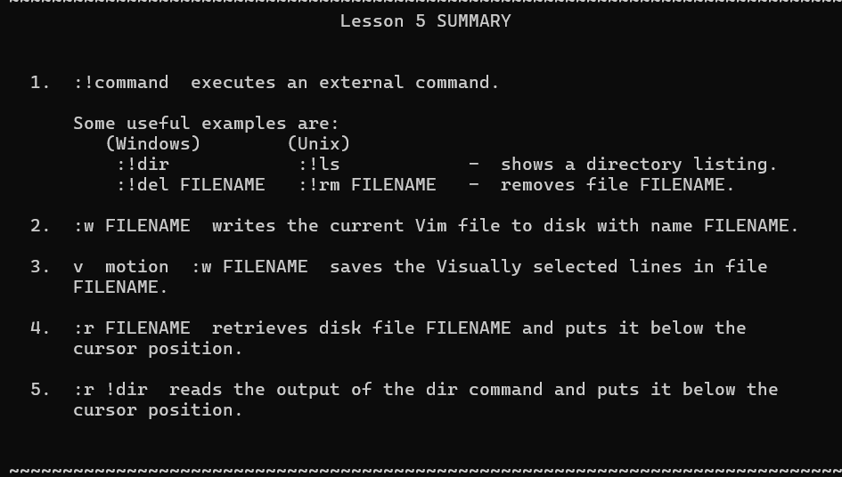

# shell

## first

- 重命名:mv

```
ls -l
drwxr-xr-x 1 missing  users  4096 Jun 15  2019 missing
```

详细列出

- 首先，本行第一个字符 d 表示 missing 是一个目录。然后接下来的九个字符，每三个字符构成一组。 （rwx）. 它们分别代表了文件所有者（missing），用户组（users） 以及其他所有人具有的权限。其中 - 表示该用户不具备相应的权限。从上面的信息来看，只有文件所有者可以修改（w），missing 文件夹 （例如，添加或删除文件夹中的文件）。为了进入某个文件夹，用户需要具备该文件夹以及其父文件夹的“搜索”权限（以“可执行”：x）权限表示。为了列出它的包含的内容，用户必须对该文件夹具备读权限（r）。对于文件来说，权限的意义也是类似的。注意，/bin 目录下的程序在最后一组，即表示所有人的用户组中，均包含 x 权限，也就是说任何人都可以执行这些程序。
- man +命令名 可以直接查看帮助(q退出)

## 流

- 通常程序的输出和输入流都是终端  
    `> file` `< file`最简单的重定向
- 您还可以使用 >> 来向一个文件追加内容。使用管道（ pipes ），我们能够更好的利用文件重定向。 | 操作符允许我们将一个程序的输出和另外一个程序的输入连接起来

## 权限

- 通常不用根用户登录，需要的时候sudo就行

```bash
echo 3 | sudo tee brightness
#行，因为打开文件的是管理员权限的tee程序
sudo echo 3 > brightness
#不行，用的是你的权限的shell去打开这个玩意，sudo执行的是echo
```

- \# 在 Bash 中表示注释，而 ! 即使被双引号（"）包裹也具有特殊的含义。 单引号（'）则不一样
- `python3 hello.py | head -n 100 > last_modified.txt`head限制输入

# shell 工具和脚本

- Bash 中的字符串通过 ' 和 " 分隔符来定义，但是它们的含义并不相同。以 ' 定义的字符串为原义字符串，其中的变量不会被转义，而 " 定义的字符串会将变量值进行替换  
    
- 进程替换（process substitution）， <( CMD ) 会执行 CMD 并将结果输出到一个临时文件中，并将 <( CMD ) 替换成临时文件名。
- an example

```bash
#!/bin/bash

echo "Starting program at $(date)" # date会被替换成日期和时间
#命令替换，将其输出替换到该位置
echo "Running program $0 with $# arguments with pid $$"

for file in "$@"; do
    grep foobar "$file" > /dev/null 2> /dev/null
    # 如果模式没有找到，则grep退出状态为 1
    # 我们将标准输出流和标准错误流重定向到Null，因为我们并不关心这些信息
    if [[ $? -ne 0 ]]; then
    #if和条件之间要有空格
    #比较尽量使用双括号
        echo "File $file does not have any foobar, adding one"
        echo "# foobar" >> "$file"
    fi
done
```

- 通配  
    
- shebang:以#!开头的字符序列(其出现在文本文件的前两个字符):类Unix操作系统的加载器会分析Shebang后的内容，将这些内容作为解释器指令，并调用该指令，并将载有Shebang的文件路径作为该解释器的参数
    - 在shebang行中使用env命令，利用环境变量中的程序来解析脚本`#!/usr/bin/env python`
    - 

## shell工具

### 查找文件:

find/fd:find -name \*pattern\*

```
# 删除全部扩展名为.tmp 的文件
find . -name '*.tmp' -exec rm {} \;
```

### 查找代码

grep:find lines that has the pattern  
history:查找历史命令(也可以用ctrl+R)

- 你可以修改 shell history 的行为，例如，如果在命令的开头加上一个空格，它就不会被加进 shell 记录中。当你输入包含密码或是其他敏感信息的命令时会用到这一特性。 为此你需要在 .bashrc 中添加 HISTCONTROL=ignorespace 或者向 .zshrc 添加 setopt HIST_IGNORE_SPACE。 如果你不小心忘了在前面加空格，可以通过编辑 .bash_history 或 .zhistory 来手动地从历史记录中移除那一项。
    - ~/.bashrc

## 作业

`--color[=WHEN] color the output WHEN; more info below`  
\[\]表示可选，=表示赋值，WHEN：always,never等等  
`-h, --human-readable with -l and -s, print sizes like 1K 234M 2G etc.`  
\-h和--human-readable是等效的，后者意思是 -lh这样用

- 编写脚本+运行函数  
      
    无限循环`for(( ; ; ))`

```bash
 #!/usr/bin/env bash
 count=0
 ./buggy.sh &>> out.log
 #标准输出和输入一起追加进去
 until [[ "$?" -ne 0 ]];
 do
     count=$((count+1))
     ./buggy.sh &>> out.log
 done

 echo "failed after $count runs"

```

`find . -type f -name "*.html" | xargs -d '\n' tar -cvzf html.zip`  
寻找所有的html文件并压缩  
\-d:设置间隔符  
\-c:创建文件  
\-v:显示详细过程  
\-z：在打包的同时用 gzip 压缩，生成 .tar.gz 文件。  
\-f：指定文件名(必须紧跟)

# 编辑器(VIM)

- ctrl+V的几种表达方式：^V、Ctrl-v、&lt;c-v&gt;
- 实际上可是块模式相当好用(精准地选择你想要的部分)


## 基本操作

### 缓存

- Vim 会维护一系列打开的文件，称为“缓存”。一个 Vim 会话包含一系列标签页，每个标签页包含 一系列窗口（分隔面板）。每个窗口显示一个缓存。跟网页浏览器等其他你熟悉的程序不一样的是， 缓存和窗口不是一一对应的关系；窗口只是缓冲区的视图。一个缓存可以在 多个 窗口打开，甚至在同一 个标签页内的多个窗口打开。这个功能其实很好用，比如可以查看同一个文件的不同部分。(命令:sp :tabnew)
- 
    - 实际上:q只是退出当前的窗口，:qa才是退出所有窗口

### 移动


### 编辑

  
可以结合计数和动词、名词，这样会重复若干次

- 修饰语
    - i(在内部)、a(在周围，包含括号) e.g: ci( 改变括号内
    - . 重复之前编辑的命令
    - a:追加模式
    - dd直接删一行
    - 关于撤销
        - 
    - r更换字符
    - ^g可显示当前文件位置，并且还有光标的位置
    - ^o回到上一个光标的位置,^i(forward)
    - 
    - 
    - 

# 数据整理

## 获取，正则

  
`ssh myserver 'journalctl | grep sshd | grep "Disconnected from"' | less`

- 引号：整个命令都在远程服务器上运行(如果没有的话只有前面哪个命令在服务器上运行，这会把整个文件传输过来)
- less 为我们创建来一个文件分页器，使我们可以通过翻页的方式浏览较长的文本。

```bash
ssh myserver journalctl
 | grep sshd
 | grep "Disconnected from"
 | sed 's/.*Disconnected from //'

#正则表达式的语法:s/REGEX/SUBSTITUTION/
```

- sed 是一个基于文本编辑器 ed 构建的 “流编辑器” 。在 sed 中，您基本上是利用一些简短的命令来修改文件，而不是直接操作文件的内容,有些匹配需要加上-E使其可用，默认情况下匹配一行，sed逐行应用

```
 | sed -E 's/.*Disconnected from (invalid |authenticating )?user (.*) [^ ]+ port [0-9]+( \[preauth\])?$/\2/'
():一个捕获
\+数字i可以使用第i个捕获到的字符串
输出第二个捕获组

```

- sort:排序(-n:数字排序) 、uniq -c：只取非重复的，并进行计数

### awk:另一种编程语言

- awk 程序接受一个模式串（可选），以及一个代码块，指定当模式匹配时应该做何种操作。默认当模式串即匹配所有行（上面命令中当用法）。 在代码块中，\$0 表示整行的内容，\$1 到 \$n 为一行中的 n 个区域，区域的分割基于 awk 的域分隔符（默认是空格，可以通过 -F 来修改）。在这个例子中
- e.g:统计所有只出现过一次并且以c开头以e结尾的(第一列为1，第二列匹配正则，打印出第二列然后使用wc统计输出行数)
- `| awk '$1 == 1 && $2 ~ /^c[^ ]*e$/ { print $2 }' | wc -l`

### 分析数据

- 每一列的数据全部相加(paste逐行合并并使用+作为分隔符，bc进行计算)  
    `| paste -sd+ | bc -l`
- xargs:将输出转化为参数列表，这样可以方便的进行批量操作  
    `rustup toolchain list | grep nightly | grep -vE "nightly-x86" | sed 's/-x86.*//' | xargs rustup toolchain uninstall`

## 作业

grep -v相反的，直接用\[^\]只能否单个字符  
  
sed最好不要原地操作  
备份：`sed -i.bak s/REGEX/SUBSTITUTION/ input.txt`

# 命令行环境

## job control

```bash
#!/usr/bin/env python
import signal, time

def handler(signum, time):
    print("\nI got a SIGINT, but I am not stopping")

signal.signal(signal.SIGINT, handler)
i = 0
while True:
    time.sleep(.1)
    print("\r{}".format(i), end="")
    i += 1
#捕获sigint却不停止执行程序
```

- ctrl+z:SIGSTOP:暂停进程
- fg和bg分别表示在前台和后台继续进行，使用%加编号表示任务
- &后缀直接表示在后台运行，输出还得再重定向一下
- 使用nohup命令，就算当前终端关了也能跑（忽略挂起信号，但是直接kill还是就没了）
- `kill -SIGHUP %2`挂起

## terminal multiplexer(终端复用器)

- 主要用tmux

### sessions(会话)


### windows(窗口)


### panes(面板)


## dotfile

### 别名

alias ls="sl"

```
# 在忽略某个别名
\ls
# 或者禁用别名
unalias la

# 获取别名的定义
alias ll
# 会打印 ll='ls -lh'
```

- 引号括起来并且不能有空格（否则会被认为有三个参数）

dotfile就是一个配置软件的文本文件(bash,ssh,vim,git,tmux常位于~/)

- 一个方便管理的办法：使用符号链接(symlink)到别的地方，然后使用git 仓库进行版本管理
- symlink:ln -k /path/to/file

## remote mechine

- ssh一个易忽略的特性就是它可以直接执行命令

### 密钥


- 使用ssh/config和sshd_config可以分别进行配置

## 作业

  
用type看是不是自建命令  
man文档：  
  
使用pkill停止进程:`pkill -af sleep`:-f表示默认匹配进程名 pkill will send the specified signal (by default SIGTERM) to each process instead of listing them on stdout.

- wait:等当前所有完事或者指定pid完事再运行别的
- pgrep sleep | wait 用了管道(会创建别的shell来运行)，wait 运行在 子 shell 里，它看不到父 shell 的后台任务（help wait 文档里的 “job ID” 部分只适用于当前 shell）
- sleep可以降低循环中的cpu消耗:忙等 = 一直占用 CPU，做重复检查 → CPU 一直活跃。阻塞等待 = 让内核“帮我等”，这段时间进程不参与调度 → CPU 空闲或做别的事。
- 一直等待到某进程结束:需要一直检测

```bash
pidwait()
{
   while kill -0 $1 # 循环直到进程结束
   do
   sleep 1 
   done
   ls
}
#kill -0 :不会发送信号，但是会在进程不存在的时候返回非零值(while可以进入0值)
sleep 60 & 
pidwait $(pgrep sleep 60)
```

### tmux

`tmux attach -t`  
rename:`tmux rename-session -t 0 database`  
`tmux kill-session`删除

#### word

lingo:行话、术语  
brag:吹牛

# 版本控制

## git的数据模型

- snapshot
    - 
- 历史记录建模，关联快照
    - 每个快照都有一系列的父辈，git中的快照又称为提交
    - 提交不可改变，更改错误实际上只是进行了一次提交
- 数据模型及其伪代码表示

```plaintext
// 文件就是一组数据
type blob = array<byte>

// 一个包含文件和目录的目录
type tree = map<string, tree | blob>

// 每个提交都包含一个父辈，元数据和顶层树
type commit = struct {
    parents: array<commit>
    author: string
    message: string
    snapshot: tree
}

type object = blob | tree | commit
//git中的blobs，提交，和树都是对象，它们引用其他对象时只是保存其哈希值作为引用
objects = map<string, object>

def store(object):
    id = sha1(object)
    objects[id] = object

def load(id):
    return objects[id]
```

- 引用
    - 引用是指向提交的指针。与对象不同的是，它是可变的（引用可以被更新，指向新的提交）。例如，master 引用通常会指向主分支的最新一次提交。
    - 当前位置的指针head

```plaintext
references = map<string, string>

def update_reference(name, id):
    references[name] = id

def read_reference(name):
    return references[name]

def load_reference(name_or_id):
    if name_or_id in references:
        return load(references[name_or_id])
    else:
        return load(name_or_id)
```

- 仓库：对象和引用

## 常用

git log -x:最后x次提交  
git blame:某个文件最后一次哪些行进行了修改  
删除敏感信息

```
 git filter-branch --force --index-filter\
 'git rm --cached --ignore-unmatch PATH-TO-YOUR-FILE-WITH-SENSITIVE-DATA' \
 --prune-empty --tag-name-filter cat -- --all
```


# 调试及性能分析

- 最简单有效的调试方式:添加打印语句进行调试
- 但是有些时候并不是特定要调试某个区域，这个时候会使日志
- 使用终端着色可以使日志更有可读性

```
#!/usr/bin/env bash
for R in $(seq 0 20 255); do
    for G in $(seq 0 20 255); do
        for B in $(seq 0 20 255); do
            printf "\e[38;2;${R};${G};${B}m█\e[0m";
        done
    done
done
```

## 第三方日志系统

对于大型软件程序，很多时候得看其依赖的日志  
通常放在/var/log之下  
系统级别的程序会将日志进行某种压缩后存储，所以需要用journalctl才能查看  
将普通日志加入到系统日志当中:logger

## 调试器

  
ipdb更好用，还有语法高亮功能  
对更底层的语言可能得用gdb等等(硬件寄存器都给你追踪到，几乎可以调试任何二进制文件)  
`python -m ipdb`(这个时候local函数就特好用)

## 专门工具

`sudo strace -e lstat ls -l > /dev/null`  
strace:追踪系统级别的命令的调用，忽视掉ls -l的输出  
对于web开发:可以查看源码，实时修改源码(网页截图是不可靠的)

## 静态分析

有些对于代码的bug不需要执行就能看出来(比如变量的重复定义或者未定义之类的)  
例如pyflakes、mypy等工具可以帮助分析传入的代码(还是不太方便，一种方法是集成到编辑器中)

## 性能分析

鉴于 过早的优化是万恶之源，您需要学习性能分析和监控工具，它们会帮助您找到程序中最耗时、最耗资源的部分，这样您就可以有针对性的进行性能优化。  
`time <command>`  


### 性能分析工具

- CPU 性能分析工具有两种： 追踪分析器（tracing）及采样分析器（sampling）。 追踪分析器 会记录程序的每一次函数调用，而采样分析器则只会周期性的监测（通常为每毫秒）您的程序并记录程序堆栈。它们使用这些记录来生成统计信息，显示程序在哪些事情上花费了最多的时间。
- 某些编程语言自带有命令行的性能分析器(cProfile)  
    `python -m cProfile -s tottime grep.py 1000 '^(import|\s*def)[^,]*$' *.py`
    - 使用 line_profiler，它会基于行来显示时间
    - `kernprof -l -v a.py`
- 对内存的分析对于python这样的语言也是很有效的,因为只要还有引用，对象就不会被丢弃
- `python -m memory_profiler example.py`
- 对于事件分析(如不佳的局部缓存性，活锁),可以使用perl分析

### 资源监控

通用、io、磁盘和内存使用、打开文件、网络连接和配置

### pdb tutorial

pdb包含在python的标准库当中`import pdb; pdb.set_trace()`就能用  
set_trace在被调用的地方加上了一个断点  
因为pdb内置命令包含很多单个字符，所以不要在自己的程序中命名单个字符变量  
ll显示当前处于的堆栈

```plaintext
n(ext) a.k.a I hope this current line doesn't throw an exception

n(ext)
    Continue execution until the next line in the current function
    is reached or it returns.
```

不带参数的b查看断点  
cl删除断点

#### 高级命令

!:表示接下来的是python命令而不是pdb命令  
pdb.pm()/pdb.post_mortem()  
事后调试 (Post-mortem Debugging)  
另一个主要用在交互式环境中

```python
import pdb
import sys

def divide(a, b):
    result = a / b
    return result

def main():
    try:
        # 这里会发生 ZeroDivisionError
        result = divide(10, 0)
        print(f"结果是: {result}")
    except Exception:
        # 程序崩溃了，我们在这里进行“事后调试”
        print("发生了一个错误，进入事后调试模式...")
        # 因为我们在except块中，所以不需要传递traceback对象
        # pdb会自动找到当前这个异常的信息
        pdb.post_mortem()

if __name__ == "__main__":
    main()
```

shellcheck:检查脚本问题  
lsof:列出打开的文件(实际上linux中 一切打开的都叫文件)  
taskset:检索指定cpu或限制使用某cpu干活  
stress:压力测试

# 元编程(metaprogramming)

- 关于流程，而不是写代码或更高效的工作。本节课我们会学习构建系统、代码测试以及依赖管理。

## 构建系统

- 当完成一整个工作(比如写论文和开发软件)，我们需要进行一系列的命令，不同资源之间有相互依赖，构建系统可以干这个，从本质上讲，这些工具都是非常类似的。您需要定义 依赖、目标 和 规则。您必须告诉构建系统您具体的构建目标，系统的任务则是找到构建这些目标所需要的依赖，并根据规则构建所需的中间产物，直到最终目标被构建出来。

### make

- 对中小型项目来说已经非常好用
- 参考makefile进行构建(总是尝试最小化过程)

```makefile
#paper.pdf目标有两个依赖项:paper.tex plot-data.png
paper.pdf: paper.tex plot-data.png
    pdflatex paper.tex#执行的命令

plot-%.png: %.dat plot.py
    ./plot.py -i $*.dat -o $@
```

### 依赖管理

- 项目的依赖也可以是项目(python,opensl等)
- 大多数依赖可以到软件仓库中获取(托管:由某些企业专营,开放:都能用)
- 很多种方式，其中一种是版本控制
- 常用版本命名法:语义命名法
    - 主版本号.次版本号.补丁号  
        
- 锁文件(lockfile):避免不必要的更新，一是防止每次都去下载更新的包导致系统构建相当之慢，极端做法(vendering):整个把项目依赖拷过来，没办法享受版本控制了

## 持续集成(CI)

- 持续集成（Continuous integration），或者叫做 CI 是一种雨伞术语（umbrella term，涵盖了一组术语的术语），它指的是那些“当您的代码变动时，自动运行的东西”
- 实际上就是一组规则，描述了当你的仓库发生什么更改时采取什么样的应对策略  
    

## hw

`git-ls-files - Show information about files in the index and the working tree`  
`git ls-files -o | grep '\.java$'`  
列举未tracked的java文件，后面是为了防止bash自动将\*.java通配符进行展开(其实就是我要的是直接的grep去找而不是展开通配符)

- .PHONY后面跟的目标都被称为伪目标，也就是说我们 make 命令后面跟的参数如果出现在.PHONY 定义的伪目标中，那就直接在Makefile中就执行伪目标的依赖和命令。不管Makefile同级目录下是否有该伪目标同名的文件，即使有也不会产生冲突。另一个就是提高执行makefile时的效率。
- Git 可以作为一个简单的 CI 系统来使用，在任何 git 仓库中的 .git/hooks 目录中，您可以找到一些文件（当前处于未激活状态），它们的作用和脚本一样，当某些事件发生时便可以自动执行。init自动生成的脚本文件以.sample结尾，这个时候不会自动运行,hook编写可以使用shell、python等脚本语言

### github pages

# 安全和密码学

## 熵

- 度量不确定性的指标，单位为比特
- 计算方法就是把所有可能性取$log_2$
- 一般来说在线式40个单位即可，离线攻击得有80个单位

## 散列函数

`printf 'hello' | sha1sum`

- 密码散列函数 (Cryptographic hash function) 可以将任意大小的数据映射为一个固定大小的输出
- 性质
    - 确定性
    - 不可逆性
    - 目标碰撞对抗性:对于一个给定输入 $m_1$，难以找到 $m_2 != m_1$ 且 $hash(m_1) = hash(m_2)$
    - 碰撞对抗性:难以找到一组满足 $hash(m_1) = hash(m_2)$ 的输入 $m_1, m_2$（该性质严格强于目标碰撞抵抗性）
- 应用:
    - git用于区分，防止不同内容具有相同的哈希值
    - 文件信息摘要:从不可靠的来源下载的文件可以去验hash
    - 承诺机制(Commitment scheme)： 假设我希望承诺一个值，但之后再透露它—— 比如在没有一个可信的、双方可见的硬币的情况下在我的脑海中公平的“扔一次硬币”。避免作弊

## 密钥生成函数

密钥生成函数 (Key Derivation Functions) ,为了对抗穷举攻击，通常较慢

- 对称加密
    - keygen():随机生成密钥
    - encropt():加密，将明文和密钥计算为密文
    - decropt():解密，密文和密钥推出明文
    - 另一种方法是使用足够高熵的口令生成密钥然后加密  
        salt(盐)：在网站的数据库中直接存密码明文或者其哈希都不太好，hacker可以使用彩虹表(一个字符串与对应哈希值的映射)来暴力破解，salt是随机用户唯一的，在数据库中，我们存的是密码+salt的整个字符的hash
- 非对称加密
    - 公钥:公开，任何人都可以使用公钥加密信息
    - 私钥:自有，我接收密文并利用私钥可以解码
    - merit:任何人都可以加密东西并发给我，不需要交换密钥
- 签名验证方法
    - verify(message, sign(message, private key), public key) = true
    - 软件签名：Git 支持用户对提交(commit)和标签(tag)进行 GPG 签名。任何人都可以使用软件开发者公布的签名公钥验证下载的已签名软件。

## 密钥分发

- 面对面交换
- 信任网络(我信任我信任的人信任的人)
- 社交网络证明(将密钥和一组身份进行绑定)
- 混合加密  
    